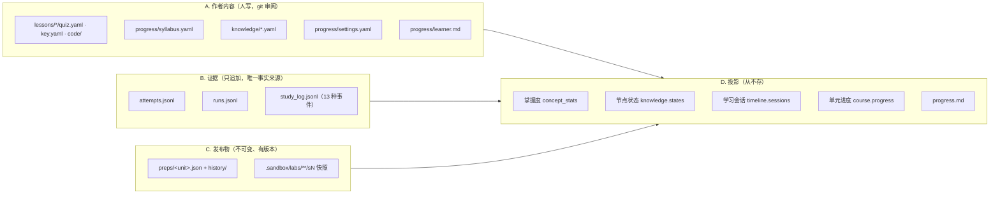
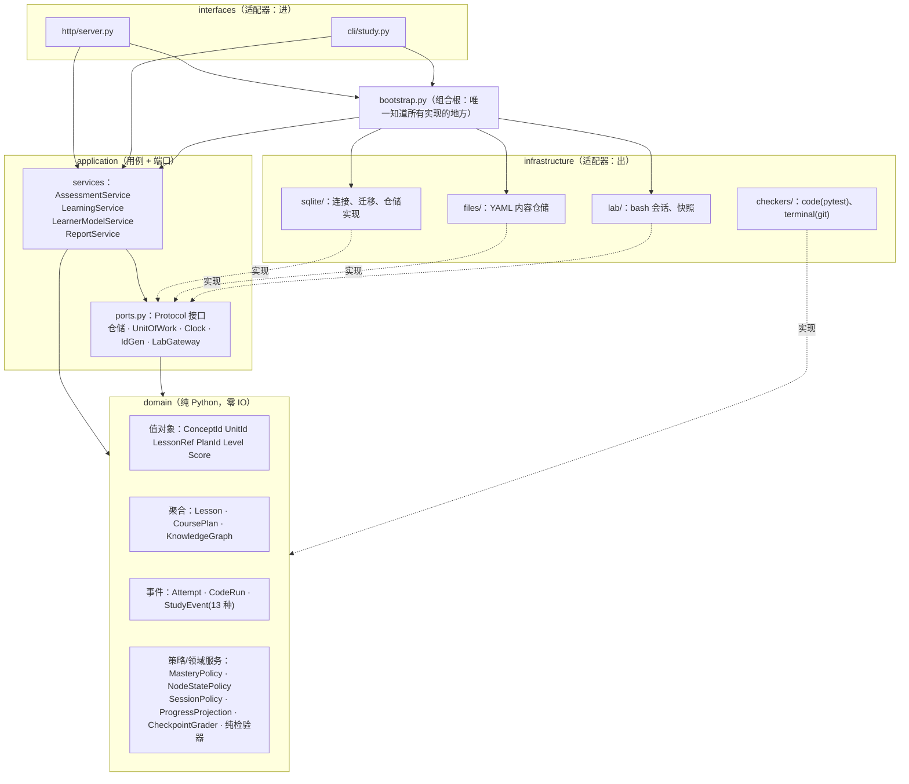

# cs-study 后端 core 重构设计（DDD + 端口/依赖注入 + SQLite）

输入：[cs-study-architecture-review.md](./cs-study-architecture-review.md)（下称"审查"）+ 重新直读 `studykit/*.py`、`study.py`、`progress/*`（2026-09-25）
范围：**只设计后端 core**（领域层 + 应用层 + 存储）。`web/index.html`、`agent_env` 的内部逻辑不在第一步里动。
状态：**已接受（D-021 ~ D-023），实施中**。数据需求见 [data-requirements.md](./data-requirements.md)，表结构见 [data-model.md](./data-model.md)。§5.2 的不变量表里提到的 `attempt` 表，以 `evidence` 表为准。

---

## 0. 结论先说

| 问题 | 答案 |
|---|---|
| 要不要上数据库？ | 要，**SQLite（标准库 `sqlite3`，WAL 模式）**。理由不是性能，而是：①跨进程写入安全（审查 P0 ②）；②事务让"写证据 + 更新视图"不再撕裂（P0 ③）；③外键和约束把"约定"变成"机制"（审查 ①④⑥⑦）；④和 nanoteacher 同一套技术（SQLite WAL），学到的东西能直接用来审 AI 写的 nanoteacher 代码。 |
| 什么进数据库？ | **运行时产生的事实**：答题记录、代码运行、学习事件、课程计划版本、练习场快照元数据。 |
| 什么**不**进数据库？ | **人手写、要在 git 里审阅的内容**：`lessons/**`（pytest 必须读真实文件，key.yaml 要 review）、`syllabus.yaml`、`knowledge/*.yaml`、`settings.yaml`、`learner.md`。它们经由"内容仓储"端口只读加载。（这一条需要你拍板，见 §8） |
| 事件溯源还保留吗？ | **保留，而且由数据库强制执行**：证据表用触发器禁止 UPDATE/DELETE；掌握度、进度、薄弱点、时长仍然现场算，不落库。 |
| 依赖注入用框架吗？ | 不用。`typing.Protocol` 定义端口 + 一个手写的组合根 `bootstrap.py`。零新依赖，读代码就能看懂谁注入了谁。 |
| 和审查 §5「不要做」清单冲突吗？ | 冲突两条（"不要引入数据库""不要加仓储接口 + DI"）。审查的前提是"单人单机、只求能用"；你现在的目标是**把 cs-study 当成一个按软件工程原则构建的样板**，并且要能扩展到多学习者。前提变了，结论跟着变。代价见 §6。 |

---

## 1. 现状盘点：数据

### 1.1 按"性质"分成四类



### 1.2 实体清单（目标里的名字 ← 现在的来源）

| 领域对象 | 类别 | 身份 | 关键字段 | 现在在哪 | 写者 |
|---|---|---|---|---|---|
| `Attempt` 作答 | 事件（实体） | `id` | lesson_ref, qid, concept, level, checker, response, score?, result, grader, feedback, detail, note, **supersedes** | `attempts.jsonl` | `server.submit`、`study.py grade/log` |
| `CodeRun` 代码运行 | 事件 | `id` | lesson_ref, qid, concept, level, kind(run/submit), code, passed, total, score, failures | `runs.jsonl` | `checkers/code.py`（唯一调用点） |
| `StudyEvent` 学习事件 | 事件 | `id` | type（13 种）, unit, **plan**, section, idx, 各类型自己的字段 | `study_log.jsonl` | `course.record/check/hint/lab_action`、`knowledge.observe`、手动补录 |
| `CoursePlan` 课程计划 | 聚合根（不可变，有版本） | `(unit, plan_id)` | provenance, parts→sections→(terms, checkpoint[], sources), lab{story, files} | `preps/*.json` + `history/` | `agent_env.evaluate.publish` |
| `Lesson` 一套题 | 聚合根（只读） | `LessonRef` = `<topic>/<slug>` | questions[]{id, concept, level, checker, prompt…}；答案在 `AnswerKey` | `lessons/**` | 导师 |
| `KnowledgeNode` | 实体 | `NodeId`（= concept id） | title, desc, kind, requires[], units[], aliases[] | `knowledge/*.yaml` | 导师 + publish 时 agent 提议 |
| `Unit` 单元 | 实体 | `UnitId` | topic, title, status, done_on, notes, concepts[] | `syllabus.yaml` | 学习者、导师 |
| `Lab` 练习场 | 聚合（跨文件系统 + 进程） | `UnitId` | 工作目录、快照集 `(plan, section)`、Shell 会话 | `~/cs-study-lab`、`.sandbox/labs`、`lab.SHELLS` | `lab.py` |
| `Settings` | 值对象 | — | unit_budget_minutes, session_minutes, max_new_terms | `settings.yaml`（缺 `max_new_terms`） | 学习者 |

### 1.3 值对象：一个连接键一个类型

| 值对象 | 格式 | 现在的校验散在哪 |
|---|---|---|
| `ConceptId` / `NodeId` | `^[a-z][a-z0-9]*(\.[a-z0-9][a-z0-9_-]*)+$` | `knowledge.ID_RE`、`agent_env.tools.NODE_ID`（两份一样） |
| `UnitId` | `^[a-z0-9]+(-[a-z0-9]+)*$` | `course._UNIT` |
| `LessonRef` | `^[a-z0-9_-]+/[a-z0-9_.-]+$` | `lessons._REF` |
| `PlanId` | provenance.run 或 `"draft"` | `course.plan_id` |
| `Level` | 1-4（掌握度） | 散落各处的 `int(a.get("level", 1))` |
| `Score` | 0-1 或 `None`（待批改） | `Verdict.score` |
| `SafePath` | 解析后必须在 base 里 | 6 处 `is_relative_to`（审查 ⑨） |

`concept` 这个键跨 6 个位置（syllabus → quiz → key → attempts → knowledge → study_log）。**上数据库之后它变成外键可以约束的列；但作者内容还在文件里，所以要一个 `ContentIntegrity` 检查（§5.4）在启动和发布时跑。**

### 1.4 StudyEvent 的 13 种类型（统一语言的一部分）

| 类型 | 来源 | 特有字段 | 被谁消费 |
|---|---|---|---|
| `open` | 客户端 | section | 进度（last_section）、时长、练习场首次快照 |
| `done` / `undone` | 客户端 | section, minutes? | 进度（没有检查点的旧节） |
| `skip` | 客户端 | section | 进度 |
| `activity` | 客户端 | kind: page/video | 时长（心跳） |
| `term` | 客户端 | node, action: open/known/unknown | 进度 terms、证据（known=+1） |
| `term_miss` | 客户端 | text（1-80 字） | 课程评测 |
| `load_rating` | 客户端 | rating 1-5 | 进度 ratings、课程评测 |
| `checkpoint` | 服务器 | idx, ok, score, response, attempt, nodes[] | 进度、证据（±1）、课程评测 |
| `hint` | 服务器 | idx, level | 进度、课程评测 |
| `lab` | 服务器 | op: run/restore/reset/fill, cmd?, rc?, outside? | 时长、审计 |
| `observation` | 服务器（导师 CLI） | node, polarity: weak/ok, note | 证据（±1） |
| `manual` | 服务器（CLI） | 补录时长 | 时长 |

`CLIENT_EVENTS` 白名单（前 8 种）是一道重要的闸门，**必须原样保留到领域层**。

---

## 2. 现状盘点：功能（用例）

按限界上下文分组。每一行在目标架构里就是**一个应用服务方法**，HTTP 和 CLI 都只调它。

### 2.1 评估（Assessment）

| 用例 | 现在的入口 | 现在的实现 | 读 | 写 |
|---|---|---|---|---|
| 列出所有课时 | `GET /api/lessons` | `lessons.list_all` | lessons | — |
| 打开一套题（含上次作答） | `GET /api/lesson` | `server.lesson_payload` | lessons, attempts | — |
| 作答中的交互（跑测试 / 终端命令） | `POST /api/act` | `server.act` → `checker.act` | lessons | **runs**（code 检验器） |
| 提交一道题 | `POST /api/submit` | `server.submit` | lessons | attempts + progress.md |
| 批改待批改题 | `study.py grade` | `cmd_grade` | attempts | attempts（supersedes） |
| 记录课外练习 | `study.py log` | `cmd_log` | — | attempts |
| 看代码题的作答过程 | `GET /api/runs`、`study.py runs` | `runs_payload`、`practice_summary` | runs | — |

### 2.2 学习过程（Learning）

| 用例 | 入口 | 实现 | 读 | 写 |
|---|---|---|---|---|
| 列出单元 | `GET /api/units` | `course.list_units` | preps, study_log | — |
| 打开单元页 | `GET /api/unit` | `course.payload` | preps, settings, knowledge, study_log, attempts, lessons | — |
| 记录客户端事件 | `POST /api/unit/progress` | `course.record` | preps | study_log（+ 练习场快照） |
| 检查点判分 | `POST /api/unit/check` | `course.check` | preps, study_log | study_log |
| 要提示 | `POST /api/unit/hint` | `course.hint` | preps, study_log | study_log |
| 练习场操作 ×5 | `POST /api/unit/lab` | `course.lab_action` | preps | 文件系统、study_log |
| 学习时长 | `study.py time` | `timeline.report` | 3 份日志 | — |
| 课程评测 | `study.py course-eval` | `course_eval.evaluate` | preps, study_log, runs/agents | —（`--write` 写报告文件） |

### 2.3 学习者模型（Learner Model）

| 用例 | 入口 | 实现 |
|---|---|---|
| 薄弱点 / 掌握度 JSON | `study.py weak` | `store.concept_stats` + `split_attempts` |
| 知识图分级查询 | `study.py kg summary/related/show`、`GET /api/kg`、`/api/kg/node` | `knowledge.summary/related/show/tree` |
| 记一条导师观察 | `study.py kg observe` | `knowledge.observe` → study_log |
| 并入 agent 提议的节点 | publish 时 | `knowledge.add_nodes`（已有节点不覆盖） |
| 生成 progress.md | `study.py status`、每次 submit/grade/log 之后 | `store.write_progress_md` |

### 2.4 备课（Course Authoring，第一步不动）

`agent run / eval / judge / publish`、`lab verify`。第一步里只把它对 core 的依赖**反转**：它通过 `PlanRepository.publish()` 写计划、`KnowledgeRepository.add_nodes()` 写节点，不再自己写文件；`sections_of` / `PLAN_SCHEMA_VERSION` 从 `agent_env.tools` 搬到领域层（审查 §3.3 ②）。

---

## 3. 按三个维度诊断现状

打分 1-5，证据都来自审查或本次直读。

| 维度 | 分 | 现在做得好的 | 卡住它的地方 |
|---|---|---|---|
| **可扩展（Scalable）** | 2 | 投影纯函数，改规则历史自动重算 | ① 跨进程写不安全（`threading.Lock` 只管一个进程）；② 每次请求全量读三份日志：`course.check()` 里 `progress()` 调了两次，每次都 `timeline.collect()` 读全部日志——O(全部事件) × 每次点击；③ 没有 `learner_id`，第二个学习者进来要改所有记录格式；④ `lab.SHELLS` 进程内状态，不能多进程 |
| **可维护（Maintainable）** | 3 | 143 个测试；不变量写在 docstring；检验器是干净的策略模式 | ① `store.py` 同时是路径配置 / IO / 领域算法 / 视图渲染，被 12 个模块 import，想换存储必须动 12 个文件；② `course.py` 9 类职责；③ 模块级全局状态（`store.ROOT` 等常量、`now()`、`SHELLS`、`_VERSIONS`）让测试只能 monkeypatch；④ `schema_version` 只写不读；⑤ 三份日志是裸 dict，拼错键静默丢数据 |
| **可理解（Understandable）** | 3 | 统一语言大体一致；每个模块开头说明职责 | ① `level/plan/check/kind/record` 一词多义；② 依赖方向有 3 处反了（course/lab/course_eval → agent_env）；③ 看文件结构看不出分层——`studykit/` 下 10 个平铺模块，谁是规则谁是 IO 要读代码才知道 |

**关键洞察**：三个维度的问题有同一个根——**没有"端口"这一层**。领域算法直接调 `store.load_attempts()`，所以：换存储要改算法（可维护）、测试要改全局（可维护）、加 learner_id 要改算法签名（可扩展）、看不出哪行是规则哪行是 IO（可理解）。

---

## 4. 目标架构

### 4.1 分层与依赖规则（单向）



**依赖规则（写成测试强制执行，见 §7 阶段 0）**：

| 层 | 可以 import | 禁止 import |
|---|---|---|
| `domain` | 标准库里的纯模块（`dataclasses`、`re`、`datetime`、`enum`、`typing`） | `sqlite3`、`yaml`、`subprocess`、`pathlib` 的 IO、`http`、任何 `application/infrastructure/interfaces` |
| `application` | `domain` | `sqlite3`、`yaml`、`subprocess`、`infrastructure`、`interfaces` |
| `infrastructure` | `domain`、`application.ports` | `application.services`、`interfaces` |
| `interfaces` | `application`（服务 + DTO）、`bootstrap` | `infrastructure`、`domain` 内部实现 |

**"单向通信"在这里有两层含义**：

1. **依赖单向**：箭头只从外向内指。领域层不知道数据库存在。
2. **数据单向（命令 / 查询分离，CQRS 简化版）**：
   ```
   命令：HTTP/CLI → Service → 领域校验 → UnitOfWork 追加事件 → commit
   查询：HTTP/CLI → Service → 仓储读事件 → 领域投影（纯函数）→ DTO
   ```
   命令只追加事件、从不改投影；投影只读事件、从不写。`progress.md` 变成一个**查询**（`study.py status` 现场渲染），而不是每次写入后的副作用——审查 P0 ③ 的"视图撒谎"从结构上消失。

### 4.2 包结构（最小版，2026-09-25 修订：个人项目早期，不做任何兼容，旧模块直接删）

```
studykit/
├── domain/            纯规则，零 IO。学习域和 harness 域各自的模块放在一起，靠依赖测试保证互不 import
│   ├── ids.py         值对象：NodeId UnitId LessonRef LearnerId（全仓唯一一份格式规则）
│   ├── errors.py
│   ├── evidence.py    证据信封 Evidence / Actor + verb 注册表（data-model §1）
│   ├── mastery.py     掌握度
│   ├── knowledge.py   知识图 + 节点状态
│   ├── plan.py        课程计划：结构、答案剃除、客户端事件校验
│   ├── progress.py    单元进度、预测负荷、检查点结果
│   ├── timeline.py    学习会话
│   ├── assessment.py  题目、Checker 协议、Verdict、choice / fill / short
│   └── harness.py     Variant、Run、RunStep、Grade（harness 阶段加）
├── app/               用例 + 端口（Protocol）。只依赖 domain
│   ├── ports.py
│   ├── learning.py    学习域的服务
│   └── harness.py     harness 的服务（harness 阶段加）
├── adapters/          端口的实现：SQLite、YAML 内容文件、pi 运行时
├── specs/cs_practice/ 代码学习这个学科 spec：code / terminal 检验器、练习场、计划规则
├── web.py             HTTP（原 server.py），只调 app
├── cli.py             命令行（study.py 只剩一行入口），只调 app
└── bootstrap.py       组合根：唯一同时知道端口和实现的地方
```

依赖规则（`tests/test_architecture.py` 强制）：`domain` → 只有 domain；`app` → domain；`specs` → domain、app.ports；`adapters` → domain、app、specs；`web` / `cli` → app、bootstrap；`bootstrap` → 全部。domain 里 `harness.py` 不 import 学习域模块，学习域模块不 import `harness.py`。

### 4.3 端口（Protocol）

```python
# application/ports.py —— 只放接口，不放实现
class Clock(Protocol):
    def now(self) -> datetime: ...

class IdGen(Protocol):
    def new(self) -> str: ...

class AttemptRepository(Protocol):
    def append(self, a: Attempt) -> None: ...
    def for_learner(self, learner: LearnerId) -> list[Attempt]: ...
    def latest_by_question(self, learner: LearnerId, lesson: LessonRef) -> dict[str, Attempt]: ...
    def get(self, attempt_id: str) -> Attempt | None: ...

class CodeRunRepository(Protocol):
    def append(self, r: CodeRun) -> None: ...
    def list(self, learner: LearnerId, lesson: LessonRef | None = None, qid: str | None = None) -> list[CodeRun]: ...
    def attach(self, lesson: LessonRef, qid: str, attempt_id: str) -> None: ...   # 提交时把之前的运行挂到这次作答上

class StudyEventRepository(Protocol):
    def append(self, e: StudyEvent) -> None: ...
    def list(self, learner: LearnerId, unit: UnitId | None = None, plan: PlanId | None = None) -> list[StudyEvent]: ...

class PlanRepository(Protocol):
    def current(self, unit: UnitId) -> CoursePlan: ...
    def version(self, unit: UnitId, plan: PlanId) -> CoursePlan: ...
    def versions(self, unit: UnitId) -> list[PlanVersionInfo]: ...
    def units(self) -> list[UnitId]: ...
    def publish(self, plan: CoursePlan) -> None: ...      # 只有备课上下文调用

class LessonRepository(Protocol):          # 文件实现；只读
    def get(self, ref: LessonRef) -> Lesson: ...
    def list(self) -> list[LessonSummary]: ...
    def for_unit(self, unit: UnitId) -> LessonRef | None: ...

class KnowledgeRepository(Protocol):       # 文件实现
    def graph(self) -> KnowledgeGraph: ...
    def add_nodes(self, nodes: list[KnowledgeNode]) -> list[str]: ...

class SyllabusRepository(Protocol): ...
class SettingsRepository(Protocol): ...

class LabGateway(Protocol):                # 练习场：文件系统 + 进程，完全在基础设施里
    def ensure(self, unit: UnitId, files: list[LabFile]) -> None: ...
    def snapshot_once(self, unit: UnitId, plan: PlanId, section: int) -> bool: ...
    def restore(self, unit: UnitId, plan: PlanId, section: int) -> None: ...
    def reset(self, unit: UnitId, files: list[LabFile]) -> None: ...
    def run(self, unit: UnitId, cmd: str) -> LabResult: ...
    def check(self, unit: UnitId, checks: list[LabCheck]) -> list[CheckResult]: ...

class UnitOfWork(Protocol):                # 一个用例 = 一个事务
    attempts: AttemptRepository
    runs: CodeRunRepository
    events: StudyEventRepository
    plans: PlanRepository
    def __enter__(self) -> "UnitOfWork": ...
    def __exit__(self, *exc) -> None: ...  # 无异常 commit，有异常 rollback
```

### 4.4 依赖注入：手写组合根

```python
# bootstrap.py —— 全仓唯一一个同时知道"接口"和"实现"的文件
@dataclass(frozen=True)
class Config:
    root: Path
    db_path: Path            # 默认 progress/study.db
    lab_root: Path           # 默认 ~/cs-study-lab
    learner: LearnerId = LearnerId("me")

@dataclass(frozen=True)
class Container:
    assessment: AssessmentService
    learning: LearningService
    learner_model: LearnerModelService
    reports: ReportService

def build(cfg: Config, *, clock: Clock | None = None, db: str | None = None) -> Container:
    clock = clock or SystemClock()
    uow_factory = lambda: SqliteUnitOfWork(db or cfg.db_path)
    lessons = FileLessonRepository(cfg.root / "lessons")
    ...
    return Container(assessment=AssessmentService(uow_factory, lessons, checkers, clock, ids, cfg.learner), ...)
```

- **服务在构造时拿到依赖**（构造函数注入），不在方法里 import。
- **测试**：`build(cfg, clock=FixedClock(...), db=":memory:")`，不再需要 monkeypatch `store.ROOT`。
- **为什么不用 `dependency-injector` 之类的库**：这里只有约 15 个对象，一个 60 行的函数就能看清全部连线；库会把"谁注入了谁"藏进装饰器和容器配置里，违背"可理解"。

### 4.5 一个用例走一遍：提交答案

```mermaid
sequenceDiagram
    participant H as http/server.py
    participant S as AssessmentService.submit
    participant LR as LessonRepository(文件)
    participant C as Checker(领域/基础设施)
    participant U as UnitOfWork(SQLite)
    H->>S: submit(LessonRef("tools/01-shell"), "q3", response)
    S->>LR: get(ref) → Lesson
    S->>C: check(question, key, ctx, response) → Verdict
    S->>S: Attempt.from_verdict(...)（领域：决定 result/grader）
    S->>U: with uow: attempts.append(a); runs.attach(ref, qid, a.id)
    U-->>S: commit（一个事务：作答 + 运行关联一起成功或一起失败）
    S-->>H: AttemptView（DTO，不含 key）
```

注意 `runs.attach` 解决了审查 ⑥：提交时把这道题之前还没归属的 `code_run` 行挂到这次 `attempt_id` 上，"跑了几次才过"变成一条 SQL，不再按时间猜。

---

## 5. 数据库设计

### 5.1 表

以 [data-model.md](./data-model.md) §4 的逻辑表结构为准（学习域：`evidence` + `evidence_node` + `artifact_version` + `publication` + `material` + `material_fetch` + `practice_snapshot`；harness 域：`variant`、`run`、`run_step`、`grade`、`dataset_case`、`experiment`、`change_proposal`、`eval_change`、`blob`）。DDL 在阶段 5 按它写，这里不再维护草图。

### 5.2 不变量：从"注释"变成"机制"

| 不变量（原来写在哪） | 现在靠什么守 | 目标里靠什么守 |
|---|---|---|
| 证据只追加（`store.record` 注释） | 自觉 | 触发器：`CREATE TRIGGER attempt_append_only BEFORE UPDATE ON attempt BEGIN SELECT RAISE(ABORT, 'append-only'); END;`，DELETE 同理；`study_event` 同样。`code_run` 只允许 `attempt_id` 从 NULL 变成非 NULL |
| 一条待批改只被批改一次 | 无（批两次会有两条） | `supersedes UNIQUE` |
| pending ⇔ score 为空 | 两处代码各自保证 | `CHECK` 约束 |
| 事件属于某一版计划 | `plan_of_event` 事后按时间推 | `(unit_id, plan_id)` 外键 |
| 跨进程写入不交错 | 只有线程锁 | SQLite WAL + `BEGIN IMMEDIATE` + `busy_timeout=5000` |
| 写证据和更新视图一致 | 两步、无事务 | 视图不再存（`progress.md` 查询时生成）；多表写在一个 UnitOfWork 事务里 |
| `schema_version` 被读取 | 无 | 迁移由 `PRAGMA user_version` 驱动；启动时版本不对直接报错 |

### 5.3 SQLite 连接约定

```python
conn = sqlite3.connect(path, timeout=5.0, isolation_level=None)   # 手动管理事务
conn.execute("PRAGMA journal_mode=WAL")
conn.execute("PRAGMA foreign_keys=ON")
conn.execute("PRAGMA busy_timeout=5000")
conn.row_factory = sqlite3.Row
# UnitOfWork.__enter__: conn.execute("BEGIN IMMEDIATE")   → 写锁在事务开始时就拿，避免死锁升级
```

这正是 nanoteacher 用的模式——以后审 nanoteacher 的 SQLite 代码时，可以拿这里当对照组。

### 5.4 文件内容和数据库之间：完整性检查

作者内容留在文件里，外键管不到它们。所以加一个领域服务 `ContentIntegrity.check()`，在 `study.py serve` 启动、`agent publish`、`study.py doctor`（新命令）时跑：

- quiz.yaml 的每个 `concept` 都在知识图或 syllabus 里（审查 ⑤ 孤儿概念）
- attempt / study_event 里出现过的 `concept_id` / `node_id` 都能在知识图里找到（报 warning，不报错）
- quiz.yaml 的 `unit` 指向存在的单元（审查 ⑦）
- `settings.yaml` 缺的键报出来（审查 §4.4 `max_new_terms`）

### 5.5 git 里还看得见进度吗？

现在 `attempts.jsonl` 进 git，你能在 diff 里看见每次答题。换成 `study.db`（二进制）后看不见了。两个做法，见 §8 决定 ①：

- **A（推荐）**：`study.db` 不进 git；加 `study.py export`，把三张证据表按原 JSONL 格式导出到 `progress/export/*.jsonl` 并提交。数据库是事实来源，JSONL 是可读的备份和 diff 视图，也是灾难恢复（`import_jsonl` 能从它重建数据库）。
- B：`study.db` 进 git。简单，但 diff 不可读、合并冲突无法解决。

---

## 6. 目标 vs 现在：三个维度

| 维度 | 现在 | 目标 | 靠哪一条设计 | 代价 |
|---|---|---|---|---|
| **可扩展** | 2 | 4 | WAL + 事务解决并发；索引让"一个单元的事件"不再全表扫；`learner_id` 从第一天就在表里；端口让存储可替换（以后 Postgres 只多一个适配器） | 多了一个二进制文件和迁移机制；`lab` 仍是单进程（放在 LabGateway 后面，第一步不解决） |
| **可维护** | 3 | 4 | 领域层零 IO → 纯单测；UnitOfWork + FixedClock 取代 monkeypatch；约束和触发器把 7 条不变量变成机制；依赖规则测试防止倒退 | 文件数从约 20 变成约 40；每加一个用例要碰 service + port + repo 三处 |
| **可理解** | 3 | 4 | 目录即分层；每个限界上下文一个 service；值对象消除 `level/plan/check` 的一词多义（`MasteryLevel` vs `HintLevel` vs `LoadLevel`）；组合根一个文件看清全部连线 | 读一条链路要跳的文件变多（interfaces → service → domain → repo）。用 §4.5 那种时序图补 |

**诚实的一句**：现在的数据量（study_log 23 行、attempts 还没有）下，性能上的"可扩展"几乎没有收益。真正的收益是**正确性**（并发、事务、约束）和**这套代码能不能成为你学软件工程的样板**。

---

## 7. 实施计划（2026-09-25 修订：不做兼容，直接到目标结构）

| 步 | 做什么 | 验收 |
|---|---|---|
| **A. domain** | 按 §4.2 收拢纯逻辑；证据信封 + verb 注册表；投影全部改成吃信封（掌握度、节点状态、进度、会话） | domain 单测；依赖测试 |
| **B. 存储 + 服务** | SQLite（`evidence` + `artifact_version` + `publication` + `practice_snapshot`）；YAML 内容仓储；`app/learning.py`；`bootstrap.py` | 服务层测试用 `build(tmp)` + 内存库；UPDATE evidence 报错；两个进程并发写不丢 |
| **C. 接口 + 学科 spec** | `web.py`、`cli.py` 只调服务；code / terminal / 练习场搬进 `specs/cs_practice`；删除 store / course / knowledge / timeline / lessons / server / lab / checkers 旧模块 | 网页走一遍全部功能；旧测试改写到新入口后全绿 |
| **D. harness** | Variant 整体哈希、统一轨迹、Grade、`AgentRuntime`；`agent_env` 拆进 domain / app / adapters | 历史运行导入后 tokens / cost 对得上 |
| **E. 导入 + 文档** | 一次性脚本把现有 JSONL、preps、runs 导进新库（导完删除脚本）；更新 CLAUDE.md、README、question-format | `weak`、`kg summary`、`time` 的结论和导入前一致 |

不保留的东西：旧模块转发壳、JSONL 适配器、没带 `plan` 的旧事件的版本推断、每节各自存出处的旧计划格式、`progress.md` 的每次写入后自动更新（改成 `study.py status` 时生成）。

### 需要同步改的规则（阶段 6）

- `CLAUDE.md`「学习环境」表：`attempts.jsonl` → `study.db`（附 `study.py export` 的 JSONL）；"不能手改、不能删行"改成"只能通过服务写入，数据库触发器会拒绝修改"。
- `CLAUDE.md`「规则」最后一条的备份清单：`progress/attempts.jsonl`、`runs.jsonl` → `progress/study.db`。

---

## 8. 已定的决定

§8 原来的 5 个问题都按建议定了（2026-09-25）：`study.db` 不进 git、导出 JSONL；作者内容留在文件里；现在就加 `learner_id`；手写组合根；先做阶段 0-3。其余决定见 [data-requirements.md](./data-requirements.md) §13 和 `design/DECISIONS.md` D-021 ~ D-023。
