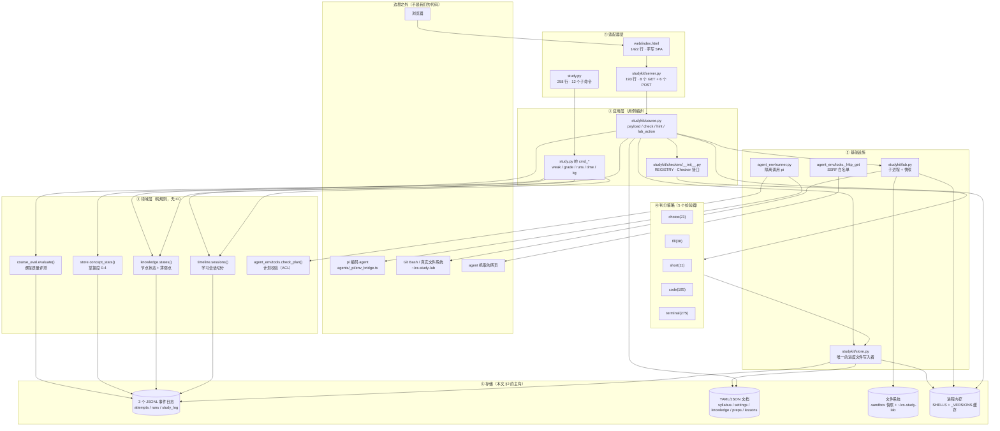
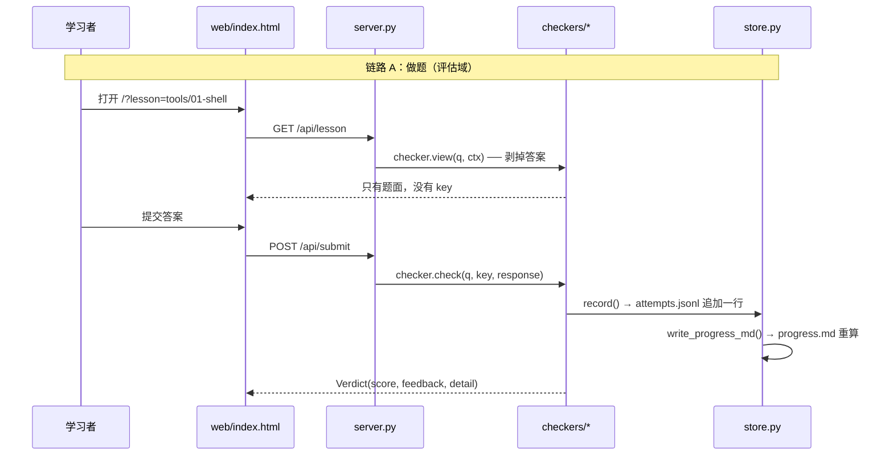
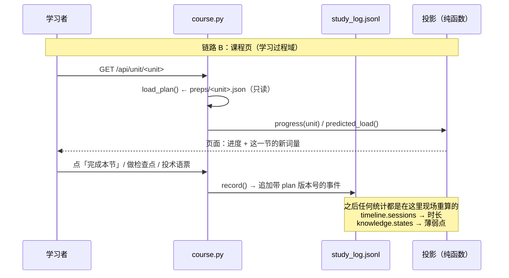
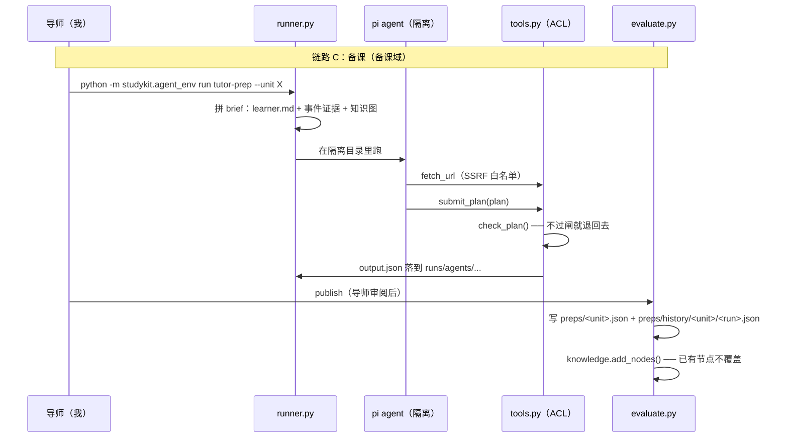
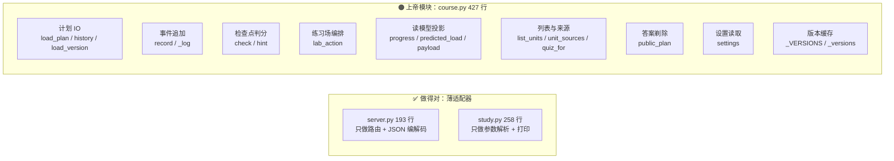
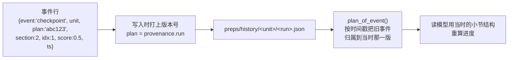
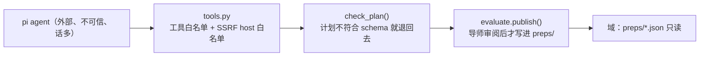

# cs-study 架构地图 + DDD / 数据库审查

审查对象：`D:\cs-study`（个人学习环境的完整代码库，72 个 git 跟踪文件，约 5,400 行产品代码 + 1,249 行测试）
审查方式：只读代码与数据，不改任何产品代码
姊妹文档：[docs/nanoteacher-architecture-review.md](./nanoteacher-architecture-review.md)（同一套方法审另一个产品）

**证据等级约定**（本文每条结论都会标注）：

| 标记 | 含义 |
|---|---|
| **实测** | 我跑过命令，本文附可复现命令与真实输出 |
| **直读** | 我读了具体文件的具体行，结论是读出来的，没跑实验 |
| **推断** | 基于直读的结构做的推断，未跑实验证实 |

---

## 0. 一句话结论

**cs-study 没有数据库。**它的"数据库"是 **3 个 append-only 的 JSONL 事件日志 + 一组 YAML/JSON 文档 + 文件系统状态**。（实测）

对"单人、单机、单进程"的学习环境来说，这个取舍基本是对的——上 SQLite 只会多一个依赖，不会多一分价值。

更值得注意的是：它在**无意中实现了一个简化版的事件溯源（Event Sourcing）+ 读模型（Read Model）架构**，而且做对了其中最难的一件事：

> `attempts.jsonl` / `study_log.jsonl` 只追加，**一切结论**（掌握度、进度、薄弱点、学习时长、预测负荷）都从证据现场重算，从不落库。

所以问题不是"不符合 DDD"，而是**边界收口没做完**：`course.py`（427 行）成了事实上的上帝模块，`store.py` 同时是 IO 层和域层，概念 id 的校验正则被抄了三份，"课程单元"和"课时 quiz"两个生命周期靠一个字符串字段挂在一起。

---

## 1. 架构地图

### 1.1 分层视图



**这张图里最该记住的一根线**：`STORE` 既在"基础设施"里，又被"领域层"和"存储"同时指着。（直读）

### 1.2 产品有几个部分

| # | 部分 | 主要文件（行数） | 一句话职责 | 谁是数据的作者 |
|---|---|---|---|---|
| 1 | **契约与文档** | `study.py`(258)、`README.md`、`CLAUDE.md`、`docs/question-format.md`、`curriculum.md` | 把"这个环境怎么用"写成可执行 + 可读的约定 | 人 |
| 2 | **判分（评估域）** | `studykit/lessons.py`(56)、`studykit/checkers/`(587) | 出题契约 + 5 种检验器，统一返回 `Verdict` | 导师（人） |
| 3 | **记录与投影** | `studykit/store.py`(232) | 进度文件的**唯一写入者**；掌握度算法；生成 `progress.md` | 程序 |
| 4 | **课程页 / 学习过程** | `studykit/course.py`(427)、`studykit/timeline.py`(153) | 课程计划、检查点判分、事件日志、学习时长 | 程序 + 学习者点击 |
| 5 | **练习场** | `studykit/lab.py`(396) | 真实 bash 会话 + 快照 + 还原/重置 | 学习者 + 程序 |
| 6 | **学习者模型** | `studykit/knowledge.py`(308) | 知识图（定义）+ 由证据推导的节点状态 | 人 + agent 提议 |
| 7 | **课程质量评测** | `studykit/course_eval.py`(165) | 只读事件日志，算课程本身好不好 | 程序（只读） |
| 8 | **Agent 环境（备课域）** | `agent_env/tools.py`(632)、`runner.py`(251)、`evaluate.py`(323)、`agents/tutor-prep/` | 把 pi 关进一个受控的盒子：工具白名单 + 计划校验 + 发布闸门 | agent + 导师审核 |
| 9 | **Web UI / HTTP** | `web/index.html`(1422)、`studykit/server.py`(193) | 手写 SPA + 薄 HTTP 适配器 | 程序 |
| 10 | **个人数据/工作区** | `progress/`、`lessons/`、`preps/`、`knowledge/`、`runs/`、`.sandbox/` | 上面 9 个部分产生的全部状态 | 混合 |

（行数 **实测**；第 10 项不是代码，是状态）

### 1.3 三条主链路的数据流







---

## 2. 存了什么数据

### 2.1 七个物理介质（再次强调：没有数据库）

| 介质 | 位置 | 谁写 | 进 git？ | 性质 |
|---|---|---|---|---|
| JSONL 事件日志 ×3 | `progress/*.jsonl` | 程序 | ✅ 是 | **事实来源** |
| YAML/JSON 文档 | `progress/`、`knowledge/`、`preps/`、`lessons/` | 人 + 程序 | ✅ 是 | 定义 + 计划 |
| 生成视图 MD | `progress.md` | `store.write_progress_md()` | ✅ 是 | **纯派生** |
| Agent 运行目录 | `runs/agents/<agent>/<run>/` | `runner.py` | ❌ 否 | 审计证据 |
| 题目沙箱 | `.sandbox/<lesson>/<qid>/` | `terminal/python` 检验器 | ❌ 否 | 隔离环境 |
| 实验快照 | `.sandbox/labs/<unit>/snapshots/<plan>/s<section>/` | `lab.py` | ❌ 否 | **不可重建** |
| 真实练习场 | `~/cs-study-lab/<unit>/`（仓库外！） | 学习者 + `lab.py` | ❌ 否 | 不可重建 |
| 进程内存 | `lab.SHELLS`、`course._VERSIONS` | 进程 | — | 易失 |

（**直读**：`store.py:14-22`、`lab.py:396`、`course.py:61`、`.gitignore`）

### 2.2 每个文件的字段形状

#### `progress/attempts.jsonl` — 掌握度的唯一证据

```jsonc
{
  "schema_version": 1,
  "id": "...",              // 单条记录 id
  "ts": "2026-...",         // ISO 时间
  "quiz": "tools/01-shell", // 课时引用 <topic>/<slug>
  "qid": "q3",
  "concept": "shell.pipe",  // ← 跨文件的连接键
  "level": 2,               // 1 记忆 / 2 理解 / 3 应用 / 4 分析
  "checker": "code",
  "response": {...},        // 学习者的原始作答
  "score": 0.75,
  "result": "pass|fail|pending",
  "grader": "auto|agent|self",
  "feedback": "...",
  "detail": {...}
}
```

**更正模式**：给一道题改分**不会改这一行**，而是追加一行新记录，带上 `supersedes: <旧 id>` 和 `grader: "agent"`。`store.split_attempts()` 把"`result == "pending"` 且没有被任何人 supersede"的记录当作待批改。（**直读**：`store.py:123-130`）

> 这是一个**做得很对**的设计。它把"我改了分"变成一个事件，而不是一次覆盖写——批改历史因此可审计。同一个文件里两份事实靠 `supersedes` 连起来，这正是事件溯源里"更正事件"的标准写法。

#### `progress/runs.jsonl` — 作答过程（**明说不参与掌握度**）

```jsonc
{ "kind": "run|submit", "quiz": ..., "qid": ..., "concept": ..., "level": ...,
  "code": "<全量代码快照>", "passed": 2, "total": 3, "score": 0.67,
  "failures": [{ "name", "outcome", "message", "lines", "call", "error" }] }
```

**唯一写入者**：`studykit/checkers/code.py:179`（实测 grep `record_run(` 只有这一个产品代码调用点）。这解释了一件事：`runs.jsonl` 只记录**代码题**的过程，其它 4 种检验器没有"过程"可言。

#### `progress/study_log.jsonl` — 课程页事件流（真正的领域事件表）

13 种事件类型 = 8 种客户端事件（`course.CLIENT_EVENTS`：`open / done / undone / skip / activity / term / term_miss / load_rating`）+ 5 种只由服务器写（`checkpoint / hint / lab / observation / manual`）。（**实测**：现在文件里实际出现过 `open` 14 次、`observation` 6 次、`done` 3 次，共 23 行）

> 注意这个 `CLIENT_EVENTS` 白名单：**服务器只接受这 8 个事件名**，其余由服务器自己写。这是很好的一道闸门——学习者无法伪造 `checkpoint` 事件说自己做对了。（直读 `course.py:24`，`record()` 里校验）

关键字段：`unit`、`plan`（**写这一行时的计划版本 id**）、`section`、`idx`、`node`、`polarity`、`score`、`minutes`、`nodes`。

#### 定义类文档

| 文件 | 关键字段 | 性质 |
|---|---|---|
| `progress/syllabus.yaml` | 科目 → `concepts[]` + `units[]{status, done_on, concepts[]}` | 手改；掌握度的"题目范围" |
| `progress/settings.yaml` | `unit_budget_minutes: 180`、`session_minutes: 45`、（代码还会读 `max_new_terms`，默认 5） | 手改 |
| `progress/learner.md` | 自由文本的学习者画像 | 手改；**只被 agent brief 消费** |
| `knowledge/<topic>.yaml` | 节点 `{title, desc, kind, requires[], units[], aliases[]}`；**故意不存状态** | 手改 + agent 提议 |
| `preps/<unit>.json` | `schema_version: 2`、`unit`、`provenance{run, published}`、`parts[].sections[]` | agent 产出、导师发布后**只读** |
| `preps/history/<unit>/<run>.json` | 同上，历史每一版 | 只有 `plan_of_event()` 读 |
| `lessons/<topic>/<NN-slug>/quiz.yaml` | `schema_version`、`questions[]{id, concept, level, checker, ...}` | 导师写，进 git |
| `lessons/.../key.yaml` | 答案 / rubric / checks / solution | 导师写，**永不发到浏览器** |

### 2.3 SOT vs 可重建（最该记住的一张表）

| 数据 | SOT？ | 由谁重建 | 丢了会怎样 |
|---|---|---|---|
| `attempts.jsonl` | ✅ **是（唯一）** | — | 掌握度全丢，无法重建 |
| `study_log.jsonl` | ✅ 是 | — | 进度/时长/术语票全丢 |
| `runs.jsonl` | ✅ 是 | — | 只丢"过程"，不影响分数 |
| `preps/*.json` + `history/` | ✅ 是 | agent 可重跑，但结果不同 | 旧事件无法归属版本 |
| `knowledge/*.yaml` | ✅ 是（定义） | — | 薄弱点无从算起 |
| `lessons/*/key.yaml` | ✅ 是 | — | 无法批改 |
| `.sandbox/labs/**/sN/` | ✅ **是**（形态上像缓存，实际不是） | ❌ **不可重建** | 无法"还原到第 N 节开始时" |
| `~/cs-study-lab/<unit>/` | ✅ 是 | ❌ 不可重建 | 学习者的真实改动 |
| `progress.md` | ❌ 派生 | `write_progress_md()` | 无损失 |
| `concept_stats()` 的掌握度 | ❌ 派生 | 现场算 | 无损失 |
| `knowledge.states()` / 薄弱点 | ❌ 派生（D-020） | 现场算 | 无损失 |
| `timeline.sessions()` 时长 | ❌ 派生 | 现场算 | 无损失 |
| `course.progress(unit)` | ❌ 派生 | 现场算 | 无损失 |
| `course_eval` 报告 | ❌ 派生（只读） | 现场算 | 无损失 |
| `runs/agents/**/events.jsonl` | ✅ 是（但被 gitignore） | ❌ 不可重建 | 备课过程无审计 |

> **这张表里藏着一个概念混淆**：`lab` 快照站在"派生缓存"的位置上（看上去像缓存，"反正能重新生成"），实际上它是**不可重建的事实来源**。任何"清理缓存"的脚本一旦扫到 `.sandbox/labs/`，就会删掉用户再也拿不回来的状态。这是**这个仓库最危险的一处认知错位**。（直读 + 推断）

### 2.4 现在实际存了什么（实测）

```
progress/study_log.jsonl     23 行：open×14, observation×6, done×3
                             涉及 unit: tools-01-shell×17, 无 unit×6
progress/attempts.jsonl      ABSENT（还不存在）
progress/runs.jsonl          3,771 字节
preps/history/               ABSENT（还没发过第二版）
runs/agents/                 8 个 run 目录，events.jsonl 合计约 99 MB
                             最大一个 43,973 KB ≈ 43 MB
progress.md                  最后写入 16:15，而 study_log 最后写入 18:03
```

最后一行是一个**已经真实发生的 bug**，见 §4.3③。

---

## 3. DDD 审查

### 3.1 评分表

| 维度 | 分数 | 一句话 |
|---|---|---|
| 统一语言 | 🟡 5/10 | 核心词表很好，但 `plan` / `level` / `check` / `kind` 各自背着 3-4 个含义 |
| 限界上下文 | 🟢 7/10 | 三个上下文真实存在且模块大体对得上；问题在共享内核 `store` 被当域层用 |
| 聚合与不变量 | 🟡 5/10 | 不变量被写成了注释（好习惯），但 `lab` 聚合横跨 3 处存储 + 内存，没有一致性保证 |
| 实体 / 值对象 | 🟡 6/10 | 领域有类型（`Verdict`/`Node`/`Event`…），但 3 张证据表是裸 dict |
| 应用层分层 | 🟠 4/10 | `server.py` 很薄很对，`course.py` 427 行混了 9 类职责 |
| 领域事件 | 🟢 8/10 | 事件溯源 + 事件版本化（`plan_of_event`），这是全仓最 DDD 的部分 |
| 防腐层 ACL | 🟢 9/10 | `check_plan` + `public_plan` 是教科书级的边界收口 |
| 仓储模式 | ⚪ 不适用 | 单进程本地工具，直接文件 IO 是正确取舍 |
| **总分** | **🟡 6/10** | 架构直觉很好，缺的是收口与类型化 |

### 3.2 统一语言：核心词表好，撞名要命

**做得好的**（直读各文件 docstring 与字段名）：

`concept`（概念）、`mastery`（掌握度）、`level`（1-4）、`checker`（检验器）、`lab`（练习场）、`plan`（课程计划）、`evidence`（证据）、`node`（知识节点）、`state`（节点状态）、`checkpoint`（检查点）、`provenance`（来源）。这套词**在代码、文档、界面里是同一个词**，这就是统一语言的定义。

**撞名清单**：

| 词 | 含义 1 | 含义 2 | 含义 3 | 含义 4 |
|---|---|---|---|---|
| `level` | 掌握度等级 1-4 | 提示分级 1-3 | 认知负荷 低/中/高 | — |
| `plan` | 课程计划（`preps/*.json`） | `plan` 版本 id（`provenance.run`） | 练习场的 plan 快照目录 | nanoteacher 的 plan（计费档，完全无关） |
| `check` | `checker.check()` 判分 | `check_plan()` 计划校验 | 检查点 `checkpoint` | `key.yaml` 里的 `checks:`（终端题断言） |
| `kind` | 题目类型（bug/project） | 代码运行类型（run/submit） | 事件类型（page/video） | 节点类型（concept/term/skill） |
| `record` | `store.record()` 写一次作答 | `course.record()` 写一个事件 | `runs.jsonl` 的一次运行 | — |

**这不是致命的**——每个含义都在不同的模块/文件里，冲突不会造成运行时错误。但它会让「读到一半忘了这个词现在指哪个」变成常态。最便宜的一处修法：把 `check_plan` 改名 `validate_plan`（一个词一个含义），把 `lab` 里的 plan 快照目录改叫 `snapshot_set`。

### 3.3 限界上下文：边界是真实存在的

三个上下文（直读 + 推断）：

| 上下文 | 模块 | 核心概念 | 它不需要知道 |
|---|---|---|---|
| **判分 / 评估** | `lessons.py`、`checkers/*` | 题、答案、分数、判定 | 课程页、学习时长、agent |
| **学习过程** | `course.py`、`timeline.py`、`store.py` | 单元、小节、事件、会话、掌握度 | 题目怎么判、agent 怎么备课 |
| **备课 / 出题** | `agent_env/*`、`agents/tutor-prep` | 计划、来源、节点提议、评测 | 学习者当下答对没答对 |

**共享内核**：`store.py`（路径常量 + JSONL 读写 + 时间）。

**边界漏了三处**：

1. `course.py:357` `predicted_load()` 依赖 `knowledge.known_titles()` → 学习过程域依赖学习者模型域，**但方向是对的**（课时 → 认知负荷），可以接受。
2. `course.py:19`、`lab.py:214`、`course_eval.py:17` 都从 `agent_env.tools` 引入 `sections_of()` / `PLAN_SCHEMA_VERSION` → **学习过程域反向依赖了 agent 环境**。这是唯一一处真正的方向错误，而且它出现了三次。`sections_of` 和 `schema_version` 属于计划文档本身，应该住在 `course.py`（或一个新的 `plans.py`），让 `agent_env` 反过来依赖它。
3. `store.py` 既是共享内核又是域层（见 §3.6）。

### 3.4 聚合与不变量

**这个仓库有一个值得表扬的习惯**：把不变量直接写在模块 docstring 里（直读）：

- `course.py:7` `INVARIANT: 课程计划只读；进度只由事件算出。每个事件记着它属于哪一版课程`
- `course.py:9` `INVARIANT: 检查点的答案、提示、参考做法只在服务器上`
- `knowledge.py:7` `INVARIANT: 节点状态只由证据算出，不手写`
- `timeline.py:8` `INVARIANT: 会话是派生数据`
- `course_eval.py:10` `INVARIANT: 只读事件日志和课程计划，不写任何东西`

**已守住的**：

- ✅ 「计划只读」——运行时确实没有任何代码写 `preps/*.json`（只有 `evaluate.publish()` 写，且是导师显式触发的命令）
- ✅ 「答案不下发」——`public_plan()` 剃答案，`checker.view()` 只返回题面
- ✅ 「状态不手写」——`states()` 是纯函数，没有任何 `set_state()`

**没守住的**：`lab` 这个聚合横跨 **4 个位置**：

```
真实练习场 ~/cs-study-lab/<unit>/                        ← 学习者在 Git Bash 里也能改
快照     .sandbox/labs/<unit>/snapshots/<plan>/sN/
内存     lab.SHELLS[unit]                                ← cwd、环境、历史
子进程   那个 bash 进程本身
```

`lab.SHELLS` 是 `_Shells` 里的 `dict[str, Shell]`（直读 `lab.py:374-396`），**每个 unit 一个 Shell 实例，进程内共享**。后果两条：

1. **重启 `study.py serve` → 会话丢失**（cwd、导出过的变量全没了），但快照还在 → 状态不一致。
2. **同一 unit 开两个浏览器标签 → 共享同一个 shell**。两个页面同时敲命令，`cwd` 会互相踩。

对一个单人学习工具，第 2 条的实际伤害有限（你不会同时开两个标签敲命令）。但它说明**这个聚合的边界没有被显式定义**，只是"碰巧能用"。

### 3.5 实体 / 值对象：一半有类型，一半裸 dict

有类型的（`@dataclass`，直读）：`checkers.Verdict`、`checkers.Ctx`、`lessons.Lesson`、`knowledge.Node`、`knowledge.Evidence`、`knowledge.NodeState`、`timeline.Event`、`timeline.Session`、`agent_env.runner.*`。

没有类型的：**3 张证据日志的每一行**。`store.record(**fields)` 收什么写什么，`_read_jsonl` 读出来就是 dict。

代价是**拼错键名不会报错，只会静默丢数据**：

- `concept_stats()` 用 `a["score"]`、`a["concept"]`、`a["level"]` —— 少一个键就是 `KeyError`（会炸，还算好）。
- 但 `knowledge.evidence()` 用 `e.get("nodes")` 之类 —— 少一个键就是**静默少一条证据**，薄弱点上少一个点，你永远不知道。

对一个"用来验证 AI 写的代码对不对"的学习环境，**静默丢数据是最坏的失败模式**：它不会报错，只会让你得出错误结论。

### 3.6 应用层：一头很薄一头很厚



`course.py` 里同时住着：**计划文档的仓储**（A1）、**事件存储的写入口**（A2）、**领域服务**（A3、A7）、**应用服务**（A4）、**读模型投影**（A5、A6）、**配置**（A8）、**性能缓存**（A9）。

这跟 nanoteacher 里 `server.py` 9464 行的病是**同一种病**，只是剂量小 20 倍。

`store.py` 的双身份更微妙（直读）：

| 它做的 | 属于哪层 |
|---|---|
| `ROOT` / `LESSONS` / `ATTEMPTS` … 路径常量 | 基础设施 |
| `_append` / `_read_jsonl` / `_write_lock` | 基础设施 |
| `concept_stats()` 掌握度算法（PASS 0.7 / WINDOW 3 / STALE 14 天） | **领域** |
| `split_attempts()` 待批改判定 | **领域** |
| `write_progress_md()` 视图渲染 | **表示** |

一个模块干了三层的活。它是全仓被 import 最多的模块——**12 个模块碰它**（`course`、`course_eval`、`knowledge`、`lab`、`lessons`、`server`、`timeline`、`agent_env/{evaluate,runner,tools}`、`checkers/code`、`study.py`，实测），所以它也是**最难替换、最难测试**的一个。

顺带一个同类的方向错误：`lab.py:214` 也在函数里 `from studykit.agent_env.tools import sections_of`——**练习场为了读计划结构，反向依赖了 agent 环境**。同一个东西被三个非 agent 模块引用，说明它放错了位置。

### 3.7 领域事件：全仓最 DDD 的部分

`study_log.jsonl` 就是一张**领域事件表**，而且比多数生产系统做得更讲究：



**为什么这是对的**：课程计划会重发（agent 重跑、导师改结构）。如果事件只记 `section: 2`，计划一改，"第 2 节完成了"就变成了错的陈述。把版本号写进事件、并按时间戳回溯（`plan_of_event`）就是事件溯源里标准的 **upcasting / 事件版本化**。

**缺的**：事件之间**没有因果链**。`lab` 事件和 `checkpoint` 事件之间只有时间戳，没有 `caused_by`。所以 `course_eval` 想算"用了几次提示才做对"只能靠 `_hints_used()` 在时间窗里数——能算，但是猜。

### 3.8 防腐层：做得最标准的一处



三层闸门（直读）：

1. **能抓什么**：`fetch_url` 有 host 白名单（SSRF 防护）
2. **能提什么**：`submit_plan` 先过 `check_plan()`，schema 不符直接打回
3. **能不能落地**：`publish` 是**导师显式命令**，agent 自己写不进 `preps/`

再加上 `public_plan()` 把 `answer/accept/regex/checks/solution/hints/traps` 剃干净再发给浏览器——和 `key.yaml` 永不进网页是**同一条原则**：**读模型 ≠ 领域模型**。

这一块我给 9/10，是本文评分最高的维度。

---

## 4. 数据库与领域设计是否合理

### 4.1 结论分两句

**第一句（选型）**：**没有数据库是对的。** 单人、单机、并发上限是"你自己开两个标签页"，SQLite 在这里只带来依赖、迁移和一把新的锁，换不来任何东西。append-only JSONL 反而白送一样数据库要给钱才买的东西：**完整的审计轨迹**（我改过哪道题的分、什么时候改的、改成什么，全在文件里）。

**第二句（设计）**：**域模型的核心是对的，收口没做完。** 证据/推导分离、答案单向下发、计划不可变+版本化——这三条是硬功夫。剩下的问题是"约定没有变成机制"：schema_version 只写不读、概念 id 正则抄三份、日志之间没有外键、`course.py` 混层。

### 4.2 做得好的地方（已核代码）

| # | 做法 | 证据 |
|---|---|---|
| 1 | **单一写入者**：进度文件只有 `store.py` 写 | `store.py` 是唯一含 `_append` 的模块 |
| 2 | **更正即事件**：改分追加 `supersedes` 而非覆盖 | `store.py:123` `split_attempts` |
| 3 | **读模型不落库**：掌握度/薄弱点/时长/进度全部现场算 | `concept_stats`、`states`、`sessions`、`progress` 都是纯函数 |
| 4 | **计划不可变 + 事件版本化** | `course.py:74` `plan_of_event` + `preps/history/` |
| 5 | **答案单向下发**：`public_plan()` 剃答案，`view()` 只给题面 | `course.py:368`、`checkers/code.py:171` |
| 6 | **ACL 三层闸门**：白名单 → schema 校验 → 导师发布 | `tools.check_plan`、`evaluate.publish` |
| 7 | **不变量写成 docstring** | 8 个模块开头有 `INVARIANT:` 块（`course`、`course_eval`、`knowledge`、`lab`、`timeline`、`agent_env/{runner,tools,__main__}`），实测 |
| 8 | **路径逃逸守卫**：6 处独立实现，都拒绝逃出基目录 | §4.3⑨ |
| 9 | **题目沙箱隔离彻底**：`GIT_CONFIG_NOSYSTEM=1`、`GIT_CONFIG_GLOBAL` 指向沙箱、`GIT_TERMINAL_PROMPT=0`、`--exec/--no-index/--output` 全禁 | `checkers/terminal.py:23,71-75,103` |
| 10 | **诚实的分层**：`runs/`、`.sandbox/`、`local.env` 都在 gitignore 里，个人运行数据不污染框架 | `.gitignore` |
| 11 | **命令路径有真正的域校验**：`course.record()` 用 `CLIENT_EVENTS` 白名单挡掉伪造事件，并逐事件校验（`term` 的 node 必须真在这一节的术语表里、`rating` 必须 1-5、`term_miss` 文本 1-80 字） | `course.py:125-163` |
| 12 | **校验在域模块里，不在 HTTP handler 里**：`server.py` 只做 JSON 编解码，把 `CourseError` 变成 400。这是"应用层薄、域层厚"的正确方向 | `server.py` vs `course.py` |

第 9 条值得单独说：把一个**真实的 git 练习终端**安全地开给学习者，比看起来难得多。`--exec` 能执行任意命令、`--no-index` 能读写沙箱外的文件、`git config` 能改全局配置。这个仓库把这三条全堵了，而且用环境变量把 git 的家目录整个搬进沙箱——**这是很扎实的工作**。

### 4.3 不合理 / 有风险的地方

#### ① `schema_version` 写进了每一种记录，读了零处　【实测】

每个追加的记录都带 `schema_version: 1`，计划带 `2`，`quiz.yaml` 也带。但**没有任何一处读取时检查它**——`_read_jsonl` 只 `json.loads`，`load_plan` 只 `json.load`。

后果：格式演进的兼容层无处安放。你现在的兼容策略是"字段只增不删"，但这是**约定，不是机制**——一个 `test_*` 也守不住它。等哪天要删一个字段，你会去翻文件手工确认。

#### ② 跨进程并发没有保护　【直读】

`store._write_lock = threading.Lock()` **只在单进程内有效**。而 `study.py serve` 和 `study.py log` / `study.py grade` 是**两个进程**。

真实场景：你在浏览器里提交答案（serve 进程在写 `attempts.jsonl`），同时终端里跑 `python study.py grade ...`（另一个进程在写同一个文件）。两个 `open(path, "a")` 并发追加——在 Windows 上，长行（JSONL 一行可能几 KB）的追加**不保证原子**。

对"掌握度的唯一证据"这种文件，这是**这个环境里最该修的一处**。

#### ③ 写入不原子 → `progress.md` 已经过期了　【实测】

`store.record()` 追加证据，`store.write_progress_md()` 重算视图——两步，没有事务。进程在两步之间死掉（或者只是**有一条写入路径忘了调第二步**），`progress.md` 就永久撒谎。

现在就能看到：

```
progress.md     最后写入 16:15:15
study_log.jsonl 最后写入 18:03:31   ← 晚了 1 小时 48 分
```

`progress.md` 是纯派生数据，所以**没有数据损失**，但它是学习者实际会看的那个界面。一份会撒谎的视图比没有视图更坏。

#### ④ 概念 id 的校验规则被抄了三份　【直读】

```python
knowledge.ID_RE  = re.compile(r"^[a-z][a-z0-9]*(\.[a-z0-9][a-z0-9_-]*)+$")
agent_env.tools.NODE_ID = <同一个模式>
course._UNIT    = re.compile(r"^[a-z0-9]+(-[a-z0-9]+)*$")   # unit 用的另一套
```

`concept` 是**跨 5 个文件的连接键**（`syllabus.yaml` → `quiz.yaml` → `key.yaml` → `attempts.jsonl` → `knowledge/*.yaml` → `study_log.jsonl`）。它的格式规则散在三处，意味着**改一处忘一处不会报错，只会让某个概念在对账时消失**。

这正是值对象该出现的位置：一个 `ConceptId` 类型，构造时校验，全仓复用。

#### ⑤ 孤儿概念被静默接受　【直读】

`knowledge.states()` 用并集把三处 id 合起来（图的节点 ∪ 掌握度统计里的键 ∪ 证据里的节点）。好处是**不会因为对账不上而报错**；坏处是**一个拼错的概念 id 永远浮现不出来**——它会变成一个永远"没学"的节点，安静地待在统计里。

对一个"要验证 AI 写的代码对不对"的环境，这恰恰是最需要报警的地方。

#### ⑥ `runs.jsonl` 和 `attempts.jsonl` 没有关联键　【直读】

两个文件都用 `(quiz, qid)` 定位同一道题，但 `runs.jsonl` 的行里不带 `attempt_id`。所以"**这次提交是跑了几次才通过的**"只能靠时间戳猜。

`CLAUDE.md` 里有一句规则是"跑了 10 次才通过的，即使满分也要在 review 里指出"——**这条规则目前无法可靠执行**，因为数据模型没给它留位置。`study.py runs` 能给你列表，但你得自己按时间对齐。

#### ⑦ `unit` ↔ `quiz` 靠字符串匹配挂在一起　【直读】

`course.quiz_for(unit)` 扫 `lessons/**/quiz.yaml`，找**里面写了 `unit: <这个单元>`** 的那个。这不是外键，是"在文档里留一句话"。

后果已经出现：`lessons/demo/00-env-check/quiz.yaml` 没有 `unit:` 字段 → 它不属于任何单元 → 从课程页永远进不去。对 demo 无所谓，但这说明**两套生命周期（单元的 / 课时的）之间没有强制关系**。

#### ⑧ 无界增长　【实测】

```
runs/agents/**/events.jsonl      8 个文件，合计约 99 MB，最大单个 43 MB
progress/runs.jsonl              每次「运行测试」都存一份全量代码快照
```

`events.jsonl` 记录 agent 的每一次工具调用和输出——**这是最大的一处**。99 MB / 8 次运行 ≈ **12 MB 一次备课**。跑 100 次就是 1 GB。

都是 gitignore 的，所以不会撑大仓库；但会在你的磁盘上安静地长。至少该有一个 `study.py runs prune --keep 5`。

#### ⑨ 路径守卫各写一遍（6 处 / 5 个模块）　【实测】

```python
lessons.py:40                 d.is_relative_to(store.LESSONS.resolve())
checkers/code.py:24           p.is_relative_to(lesson_dir.resolve())
checkers/terminal.py:65       p.is_relative_to(self.work.resolve())
lab.py:119                    target.is_relative_to(root) and target != root / 或 under SANDBOX
lab.py:189                    p.is_relative_to(self.work.resolve())
agent_env/evaluate.py:27      d.resolve().is_relative_to(base.resolve())
```

**每一处都是对的**（这是最重要的），但每一处都是一份可能被后人抄错的代码。抽一个 `safe_path(base, rel)` 就能把 6 份变成 1 份。

#### ⑩ `learner.md` 是第二份学习者事实来源　【直读】

`knowledge.py` 的 `INVARIANT` 明说「手写的薄弱点会和答题证据打架，所以不手写」。但 `progress/learner.md` 仍然存在，而且**只有它被塞进 agent brief**（`runner.py`）。

好消息：`learner.md` 自己写了边界（"具体哪些知识点薄弱不写在这里"），文件本身是有纪律的。
坏消息：**纪律靠人维持**。两份文件描述同一个学习者，一份由证据算、一份由手写，agent 同时读到两份——它们可以矛盾，而没人会发现。

#### ⑪ `/api/kg?topic=` 缺同级校验　【直读】

兄弟路由都有严格校验（`_REF`、`_UNIT`），但知识图路由接受自由文本 topic。`knowledge.topic_file()` 内部有 `_safe_rel` 兜住，所以**不构成漏洞**，但它是"同一层里有一处没跟上"的信号。

#### ⑫ `course_eval` 的预测负荷在 `runs/` 被删后静默降级　【直读】

`_known_at_generation(pid)` 读 `runs/agents/**/context.json` 来还原"agent 生成这一版计划时，学习者已经会什么"。但 `runs/` 是 gitignore 的，删掉就没了。

它会返回 `None` 并在输出里标 `known_at_generation: false`（**这点做得好，没有假装**），然后退化成"所有术语都算新词"→ 预测负荷被系统性高估。报告不会崩，但结论会错。

### 4.4 「声明 ≠ 实现」清单

| 声明在哪 | 声明了什么 | 实现实际是 | 证据 |
|---|---|---|---|
| README 目录树 | 列出主要文件 | **缺** `studykit/agent_env/`、`agents/`、`preps/`、`runs/`、`design/`、`knowledge/` 的说明 | 直读 README 目录块 vs `git ls-files` |
| `progress/settings.yaml` | 提供设置项 | 代码读 `max_new_terms`，**文件里没这个键**（走默认 5） | 直读 `course.py` / `tools.py` |
| 所有追加记录 | `schema_version` | **无人读取校验** | 见 §4.3① |
| `CLAUDE.md` | "跑了很多次才通过的要指出" | `runs.jsonl` 无 `attempt_id`，**无法可靠关联** | 见 §4.3⑥ |
| `course.py:7` | "计划只读" | ✅ 兑现 | 直读 |
| `course.py:9` | "答案只在服务器" | ✅ 兑现 | 直读 |
| `knowledge.py:7` | "状态不手写" | ✅ 兑现 | 直读 |
| README 掌握度规则 | "最近 3 次平均 ≥ 0.7" | ✅ 兑现（`WINDOW=3`、`PASS_SCORE=0.7`） | 直读 |

---

## 5. 改造优先级建议

先给一个**"不要做"清单**，因为对这个规模的项目，不做比做更重要：

- ❌ **不要引入数据库**。当前并发上限是"你自己"，SQLite 只会带来迁移负担。
- ❌ **不要拆微服务 / 不要加消息队列**。单人工具，进程内调用是对的。
- ❌ **不要为了"更 DDD"而加仓储接口 + 依赖注入容器**。会显著变长，换来零收益。
- ❌ **不要重写 `course.py`**。先把新东西放对位置，让它自然变瘦。

然后是值得做的：

| 优先级 | 做什么 | 为什么 | 大致成本 |
|---|---|---|---|
| **P0** | `attempts.jsonl` / `study_log.jsonl` 写入加**跨进程文件锁**（Windows 上用 `msvcrt.locking` 或"写临时文件 + 原子 rename"） | §4.3② —— 唯一的证据文件被两个进程并发追加 | 小 |
| **P0** | `record()` 改成"追加证据 + 立即重算视图"的**单一入口**，或干脆让 `progress.md` 在读取时生成 | §4.3③ —— 视图已经在撒谎 | 小 |
| **P1** | 建一个 `ConceptId` 值对象，**删掉三份重复正则** | §4.3④ —— 跨 5 文件的连接键 | 小 |
| **P1** | `states()` 里对孤儿概念**出一条 warning**（不是报错） | §4.3⑤ —— 静默的错误结论最危险 | 小 |
| **P1** | `runs.jsonl` 记录里加 `attempt_id`，`record()` 返回 id | §4.3⑥ —— 让 CLAUDE.md 的规则可执行 | 小 |
| **P2** | `.sandbox/labs/` 在 `.gitignore` 旁**加一行注释说明它不可重建**，或搬到和 `runs/` 同级的 `snapshots/` | §2.3 —— 防止未来"清理缓存"误删 | 极小 |
| **P2** | 加 `study.py runs prune --keep N` | §4.3⑧ —— 99 MB / 8 次 | 小 |
| **P2** | 把 `sections_of()` / `PLAN_SCHEMA_VERSION` 从 `agent_env.tools` 移到计划文档模块，**反转依赖方向** | §3.3 第 2 点 | 中 |
| **P2** | 把 `check_plan` 改名 `validate_plan` | §3.2 —— 一个词一个含义 | 极小 |
| **P2** | 抽一个 `safe_path(base, rel) -> Path`，6 处守卫合成 1 份 | §4.3⑨ | 小 |
| **P3** | 把 `store.py` 的域函数（`concept_stats`/`split_attempts`）拆到 `mastery.py`，`store.py` 只留 IO | §3.6 | 中 |
| **P3** | 把 `course.py` 的读模型（`progress`/`predicted_load`/`payload`）拆到 `course_read.py` | §3.6 | 中 |
| **P3** | 三张日志的行加 `TypedDict` 或轻量校验 | §3.5 | 中 |
| **P3** | README 目录树补齐 | §4.4 | 极小 |

**如果只做一件事**：做 P0 的两条。它们都关于"唯一的证据文件"，而且都是小改动。
**如果要理解这个架构**：读 `store.py` 的 `concept_stats` + `split_attempts`（80 行），它就是这个产品的灵魂。

---

## 6. 自己复核（命令已验证可用）

> 在 **Git Bash**（或 WSL）里跑；PowerShell 里没有 `grep`/`du`，但 `git grep` 两边都有。

```bash
# ── 0. 建立基线：现在有多少代码、测试是否全绿
cd /d/cs-study
git ls-files | wc -l                      # 期望 72
python -m pytest tests -q                 # 期望 143 passed

# ── 1. 「没有数据库」是真的吗？（§0 的核心证据）
grep -rniE "sqlite|sqlalchemy|sqlmodel|alembic" \
  --include="*.py" --include="*.txt" --include="*.toml" . | grep -v tests/
# 期望：0 命中
# 全仓搜同一个词（含 md）只在 5 个文件里出现，全部是散文讨论：
#   CLAUDE.md(1)  curriculum.md(1)  design/DECISIONS.md(2)  progress/learner.md(1)
#   docs/nanoteacher-architecture-review.md(10) ← 审的是另一个产品
cat requirements.txt
# 期望：pytest>=8  pyyaml>=6 —— 只有这两个依赖

# ── 2. 进度文件到底有几个写入者？（§4.2①）
grep -rn "def _append\|_append(" studykit/*.py
# 期望：只有 store.py

# ── 3. 掌握度算法实现 vs README 声明（§4.4）
grep -n "PASS_SCORE\|WINDOW\|STALE_DAYS" studykit/store.py
# 期望：0.7 / 3 / 14

# ── 4. 概念 id 正则抄了几份？（§4.3④）
grep -rn "ID_RE\|NODE_ID" studykit/ | grep re.compile
# 期望：2 行，模式完全相同
#   studykit/knowledge.py:21:        ID_RE = re.compile(r"^[a-z][a-z0-9]*(\.[a-z0-9][a-z0-9_-]*)+$")
#   studykit/agent_env/tools.py:260: NODE_ID = re.compile(r"^[a-z][a-z0-9]*(\.[a-z0-9][a-z0-9_-]*)+$")

# ── 5. schema_version 谁在读？（§4.3①）
grep -rn "schema_version" studykit/ study.py | grep -v '"schema_version":'
# 期望：0 行 —— 这个键只在字面量字典里被写过，没有任何读取/校验

# ── 6. 跨进程锁？（§4.3②）
grep -rn "_write_lock\|threading.Lock\|fcntl\|msvcrt" studykit/
# 期望：3 处 threading.Lock（store._write_lock、lab.Shell.lock、lab._Shells._lock）
#       0 处 fcntl/msvcrt —— 全部只在单进程内有效

# ── 7. 谁 import 了 store.py？（§3.6 双身份的证据）
git grep -lE '(^|[^a-z_])store\.' -- 'studykit/*.py' 'studykit/**/*.py' 'study.py' | wc -l
# 期望：12 个文件（course_eval course knowledge lab lessons server timeline
#       agent_env/evaluate agent_env/runner agent_env/tools checkers/code study.py）

# ── 8. 进程内存里的聚合状态（§3.4）
grep -n "SHELLS\|_VERSIONS" studykit/lab.py studykit/course.py
# 期望：一个 dict[str, Shell] + 一个 mtime 缓存

# ── 9. 路径守卫抄了几份？（§4.3⑨）
git grep -cn 'is_relative_to' -- 'studykit/*.py' 'studykit/**/*.py'
# 期望：6 处，分布在 5 个文件（lab.py 有 2 处）

# ── 10. 实测现在存了什么（§2.4）
python -c "import pathlib;[print(p, p.exists()) for p in [pathlib.Path('progress/attempts.jsonl'), pathlib.Path('preps/history')]]"
# 期望：False False

# ── 11. 实测 events.jsonl 有多大（§4.3⑧）
du -sh runs/agents 2>/dev/null; ls -lS runs/agents/*/*/events.jsonl 2>/dev/null | head -3

# ── 12. progress.md 是不是过期的（§4.3③）
ls -l --time-style=full-iso progress.md progress/study_log.jsonl
# 期望：progress.md 比 study_log.jsonl 旧

# ── 13. 真实练习场和快照各自在哪（§2.3）
python -c "from studykit import lab; print('lab_root  =', lab.lab_root()); print('state_dir =', lab.state_dir('tools-01-shell')); print('snapshot  =', lab.snapshot_path('tools-01-shell', '<plan>', 1))"
# 期望：lab_root 在仓库外（~/cs-study-lab），state_dir 在 .sandbox/labs/<unit> 下

# ── 14. 接口面有多大（§1.1）
grep -c 'url.path ==' studykit/server.py; grep -c 'self.path ==' studykit/server.py
# 期望：8（GET：/ 页面 + 7 个 /api/*）  6（POST 全是 /api/*）

# ── 15. 不变量写在几个模块头部（§4.2⑦）
git grep -lE '^INVARIANT' -- 'studykit/*.py' 'studykit/**/*.py' | wc -l
# 期望：8（store.py 和 tools.py 各还有一处在函数体内，是缩进的，不匹配）

)
```

> 每一条的"期望"都是我在这台机器上跑出来的真实结果。如果你的结果不同，说明代码已经变了——**先信命令，不要信这份文档**。

---

## 7. 证据等级标注

| 本文结论 | 等级 | 依据 |
|---|---|---|
| 没有数据库 | **实测** | §6 第 1 条 grep，产品代码零命中 |
| 72 个跟踪文件 / 143 测试通过 | **实测** | §6 第 0 条 |
| 各模块行数（`course.py` 427 等） | **实测** | `Get-Content ... .Count` |
| `attempts.jsonl` 不存在、`preps/history` 不存在 | **实测** | §2.4 探针 |
| `study_log` 23 行 = open 14 / observation 6 / done 3 | **实测** | §2.4 探针 |
| `events.jsonl` 合计约 99 MB、最大 43 MB | **实测** | §2.4 探针 |
| `progress.md` 比 `study_log` 晚 1h48m 过期 | **实测** | 文件 mtime |
| `store.py` 是唯一写入者、掌握度参数 0.7/3/14 | **直读 + 实测** | `store.py:31,48,72-88`；`_append` 只有 store 一处定义 |
| `record_run` 只有一个调用点（code 检验器） | **实测** | grep |
| 12 个模块碰 `store.py` | **实测** | §6 第 7 条 |
| 三份 id 正则、`_write_lock` 是 `threading.Lock` | **直读 + 实测** | `knowledge.py:21`、`tools.py:260` 模式相同；`store.py:31`，全仓 0 处 `fcntl/msvcrt` |
| `schema_version` 只写不读（0 处读取） | **实测** | §6 第 5 条返回 0 行 |
| `course` / `lab` / `course_eval` 反向依赖 `agent_env.tools` | **直读** | `course.py:19`、`lab.py:214`、`course_eval.py:17` |
| 依赖只有 `pytest` + `pyyaml` | **实测** | `requirements.txt` |
| `plan_of_event` / `supersedes` / `public_plan` 的作用 | **直读** | `course.py:74,368`、`store.py:123` |
| `SHELLS` 每 unit 一个、进程内存、重启丢失 | **直读 + 推断** | 读 `_Shells` 实现；"重启丢失"是推断（未做重启实验） |
| 「限界上下文边界画在哪」 | **推断** | 基于 import 图与 docstring 的不变量，是我的归纳 |
| 「拆 `course.py` 要花中等人力」 | **推断** | 基于 427 行的职责数与会调用点数量 |
| 权限/越权风险（跨进程并发、静默丢数据） | **直读 + 推断** | 机制直读；"什么时候会真出事"是推断，未构造复现 |

### 这份审查本身的局限

1. **我是这个仓库的维护者之一**（按 `CLAUDE.md`，导师在这个仓库里写代码）。维护者审自己的代码，天然偏向"我知道这是为什么"而不是"这对新人友好吗"。**请把本文当"内部视角的账本"，不是"外部视角的验收"。**
2. **没有做动态验证**：所有"重启会丢""并发会踩"都没有真正构造复现实验，标为推断。想升级成实测，命令在 §6。
3. **没读的部分**：`web/index.html`（1422 行）只看了 `RENDERERS` 结构，没逐行审；`agent_env/evaluate.py` 的 judge 打分细节没审；`preps/tools-01-shell.md` 与 `lessons/demo/**` 的内容质量没审。
