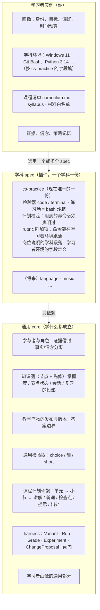
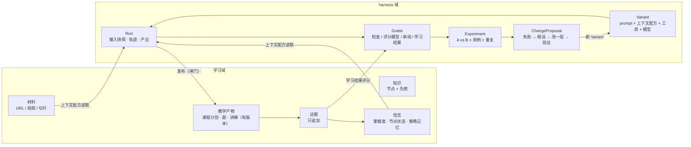
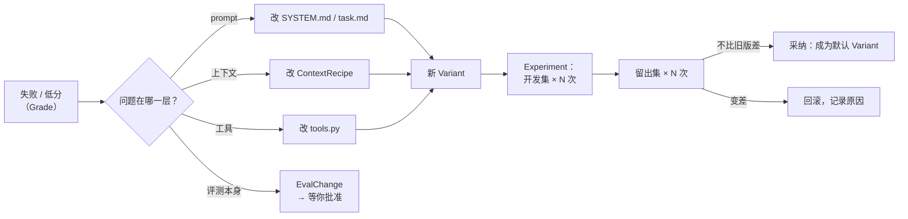

# cs-study 数据需求与领域逻辑（先于表结构）

目的：从**现有功能**和**可预见的功能**推出"要存哪些数据、每类数据是什么性质、谁写谁读、多久不变"，
分清**不变的层**和**会变的层**。表结构、存储选型、分层代码都从这份文档推出来，不反过来。
前序：[cs-study-architecture-review.md](./cs-study-architecture-review.md)（现状）
后续：[backend-core-design.md](./backend-core-design.md)（分层与 DI 草案；§6 表结构要按本文重推）
状态：草案 v3（2026-09-25，加入三层：通用 core / 学科 spec / 学习者实例）。标 **【默认】** 的是按导师的理解先推进的决定，学习者可以推翻；标 **【待问】** 的还没定，见 §13。

---

## 0. 结论

1. **参与者只有三种：learner（你，唯一的人）、agent、system。** "导师"不是人，是在这个仓库里运行的 Claude Code 会话（`CLAUDE.md` 是它的岗位说明）。agent 之间权限差别很大，所以权限按**角色**（tutor / tutor-prep / 将来的 explainer、optimizer）分，不按类型分。
2. **系统里有两个领域，靠一根线连起来。**
   - **学习域**：你学什么、学得怎样。核心是*证据*（发生过的事）和*信念*（从证据推出的判断）。
   - **harness 域**：agent 怎么工作、做得好不好、怎么变好。核心是 *Variant*（prompt + 上下文配方 + 工具 + 模型的一个版本组合）、*Run*、*Grade*、*Experiment*、*ChangeProposal*。
   - **连接线**：agent 的产出变成你用的课程；你学习时留下的证据反过来给这次产出打分（"学习结果"评分）。这是整个系统能说"这个 prompt 真的让人学得更好"的唯一依据。
3. **不变的是"形状和规则"，会变的是"内容和实现"。** 两个领域各有一个稳定的核：学习域是证据信封 + 事实 / 信念分离 + 版本化发布；harness 域是 Variant → Run → Grade → Experiment → ChangeProposal 这条链 + "优化者不能改评测"。agent 种类、prompt、模型、loop 运行时（现在是 pi）、题型、事件类型、推导规则、存储技术都在会变的一侧。
4. **三层：通用 core / 学科 spec / 学习者实例（§2）。** cs-study 是通用的学习 harness；"学代码"是一份学科 spec（`cs-practice`），提供检验器、练习环境、计划校验、环境字段；你的画像、课程清单、证据是实例。判断标准：换成学日语还成立吗？
5. **agent loop 是借来的（pi），harness 是自己的。** 这是对的分工，但 loop 要能换：pi 的事件格式现在直接存进了我们的运行记录，要在 harness 里统一成自己的轨迹格式。

---

## 1. 方法：功能 → 问题 → 数据

对每个功能问四件事：

| 问 | 为什么要问 |
|---|---|
| 这个功能要**回答什么问题**？ | 数据是为回答问题存在的，没有问题的数据不存 |
| 回答它需要哪些**事实**？ | 事实决定要记什么 |
| 哪些东西是**推出来的**？ | 推出来的不存（或存成带出处的缓存） |
| 谁**写**、谁**读**、多久**变**一次？ | 决定边界、权限和存储方式 |

---

## 2. 三层：通用 core / 学科 spec / 学习者实例

cs-study 的目标是一个**通用的学习 harness**。"学代码"只是插在上面的一份学科 spec，你自己的学习计划是这份 spec 下的一个实例。
判断一样东西放哪一层，只问一句：**换成学日语、学乐理，它还成立吗？**



### 2.1 学科 spec 提供什么（扩展点）

一份学科 spec 就是一个目录（类比 `agents/<name>/`），声明下面这些。core 只通过这些接口认识学科。

| 扩展点 | core 定义的接口 | cs-practice 现在的内容（从代码里找出来的） |
|---|---|---|
| **检验器** | `Checker`：view / act / check → Verdict（D-001） | `code`（pytest）、`terminal`（git 沙箱） |
| **检查点题型** | 计划里检查点的 `type` | `lab`（在练习场里完成任务，检查状态）；choice / fill 属于 core |
| **练习环境** | `PracticeEnv`：准备 / 快照 / 还原 / 执行 / 检查 | 练习场 = `~/cs-study-lab/<unit>` + bash 会话（`lab.py`） |
| **计划校验规则** | `check_plan` 的学科规则部分 | "讲解和动手里用到的命令必须已掌握或已列进 terms"（`tools.command_words` / `inline_commands`）、lab 必须有 checks 和 solution |
| **学习者环境字段** | 画像里 `env` 部分的 schema | 操作系统、shell、已装的工具及版本 |
| **岗位说明的学科段落** | Variant = core prompt + spec 片段 | "你是一名**计算机课程**助教……右边是一个真实的终端" |
| **rubric 附加项** | rubric = core 条目 + spec 条目 | `personalized` 里"命令能在 Windows + Git Bash 跑通" |
| **知识节点类型** | 节点 `kind` 的可选值 | core：concept / skill；cs-practice 加 `term`（术语 / 命令） |
| **材料类型** | 材料登记 + 切片器 | 网页、视频（现在都是 URL） |

### 2.2 现在哪些东西放错了层

| 现在的位置 | 实际属于 | 说明 |
|---|---|---|
| `agents/tutor-prep/SYSTEM.md` 整份 | core 一半 + cs-practice 一半 | "是讲课不是指路""一节只引入少量新东西""检查点检验会做"是通用教学原则；"终端""练习场""命令"是学科内容 |
| `agent_env/tools.py` 的 `PLAN_SCHEMA` | core 骨架 + cs-practice 的 `lab` 字段 | `_LAB`、`_CHECK.run`、检查点 `type: lab` 要挪进 spec |
| `agent_env/tools.check_plan` | core 规则 + cs-practice 规则 | 预算、新词上限、出处必须打开过 → core；命令声明、lab 校验 → spec |
| `studykit/lab.py`、`checkers/code.py`、`checkers/terminal.py` | cs-practice | 整体搬进 spec |
| `agents/tutor-prep/evals/rubric.md` | core 条目 + cs-practice 条目 | 同上 |
| `progress/learner.md` 的"电脑"一行 | 实例 × cs-practice 的环境字段 | 见 §7.2 |
| `curriculum.md` | 实例 | 你的课程清单，不是 spec |
| `progress/settings.yaml`（单元预算、每次学习时长、新词上限） | 实例（字段由 core 定义） | 时间预算和负荷上限学什么都有 |

一个 spec 就能说明这三层的边界：**cs-practice 规定"学习者环境要填操作系统和 shell"，你的实例填"Windows 11 + Git Bash"**。前者换个学习者也成立，后者只对你成立。

---

## 3. 参与者与角色

### 3.1 三种参与者

| 类型 | 是谁 | 特点 |
|---|---|---|
| **learner** | 你 | 系统里唯一的人。学习、答题、提意见；**对设计决定和评测标准拍板**。时间和注意力是最稀缺的资源——需要你确认的环节要少而关键 |
| **agent** | 会做判断、会出错、要被评测的程序 | 见 2.2 |
| **system** | 确定性代码：检验器、投影、runner、闸门 | 不做判断，只执行规则；规则本身有版本 |

### 3.2 agent 的角色和权限

| 角色 | 现在是谁 | 运行方式 | 能写什么 | 被什么约束 |
|---|---|---|---|---|
| **tutor**（导师） | Claude Code 会话 | 和你交互，有整个仓库的读写权限 | 出题、批改分数、观察、审阅记录、发布、改其他 agent 的 prompt 和环境 | `CLAUDE.md` 的规则；你的拍板 |
| **tutor-prep**（备课） | pi + DeepSeek | 批处理，关在工具白名单里 | 只能提交一份课程计划（提议） | 工具白名单、`submit_plan` 校验、发布闸门 |
| **explainer**（讲解，将来） | — | **两种都要**：先批处理生成讲解稿（像 tutor-prep），学习时在课程页里实时追问（和 D-018 提问合并） | 讲解稿（提议，走发布闸门）；回答、观察、策略假设 | 只能引用材料切片；回答要有出处 |
| **optimizer**（优化者） | **由 tutor 兼任**，流程稳定后再拆成独立 agent | 批处理 | 新的 Variant、ChangeProposal（每次都要写） | **不能改评测**（§10.5） |

**权限原则（不变）**：
- 权限跟角色走，不跟"是不是 AI"走。tutor 是 AI，但它是监督者；tutor-prep 也是 AI，但它是被隔离的工人。
- 每条数据都记 `actor = {type, id, role, variant}`：是谁、以什么角色、用的哪个版本做的。
- 需要**你**确认的环节只有：设计决定、评测标准（用例 / rubric / 评分器）的变更。其余由 agent 按规则完成，但全部留痕，你可以事后推翻。【默认】

### 3.3 一个要说清的事实

现在流程里写的"导师审阅后才发布"，实际上是 **一个 AI（tutor）审另一个 AI（tutor-prep）**。这不一定错，但要在数据上看得出来；并且 tutor 自己的工作（出的题好不好、批改准不准）现在**没有被评测**——它的 prompt 就是 `CLAUDE.md`，不在任何版本记录里。§10.7 把它也纳入 harness。

---

## 4. 两个领域和连接线



两个循环：
- **学习循环**（小时级）：产物 → 你学 → 证据 → 信念 → 下一次备课的上下文。
- **改进循环**（天 / 周级）：Run → Grade → Experiment → ChangeProposal → 新 Variant。

两个循环共用"证据"这个节点。所以学习域的证据设计直接决定 harness 能不能按学习结果评测。

---

## 5. 学习域：现有功能的数据推导

### 5.1 学习者侧

| 功能 | 要回答的问题 | 需要的事实 | 推出来的 | 写者 → 读者 |
|---|---|---|---|---|
| 做题、提交 | 这道题他答对了吗？ | 作答内容、判分结果、**题目版本** | 分数、pass/fail | system（检验器）→ learner、掌握度 |
| 批改 | 简答题几分、错在哪？ | 待批改的作答、批改分和理由（**更正**，不是覆盖） | 当前有效分数 | agent:tutor → 掌握度 |
| 代码题过程 | 他跑了几次才过、卡在哪？ | 每次运行的代码快照、失败测试；**属于哪次提交** | 首次通过在第几次 | system → agent:tutor |
| 课外练习 | LeetCode 做得怎样？ | 概念、级别、自评分 | — | learner → 掌握度 |
| 课程页进度 | 这一节学完了吗？ | 打开、检查点作答、跳过、完成；**当时是哪一版课程** | 每节通过 / 跳过、最后位置 | learner → 课程页 |
| 检查点与提示 | 这题难不难、要了几次提示？ | 每次作答、每次要提示（**提示和作答的因果**） | 首次正确率、提示用量 | learner → 学习结果评分 |
| 练习场 | 他在终端里做了什么？能回到第 N 节开始时吗？ | 每条命令和退出码；每节开始时的快照 | — | learner → agent:tutor、还原 |
| 新词反馈 | 这个词他本来就会吗？ | 👍👎、划词没讲到的词 | 已知词表、预测负荷 | learner → 下一次备课 |
| 费劲程度 | 这一节讲得太难吗？ | 1-5 评分 | 预测 vs 实际 | learner → 学习结果评分 |
| 学习时长 | 今天学了多久、花在哪？ | **所有**带时间的事件 + 手动补录 | 会话、每节用时 | system → learner |
| 掌握度 / 薄弱点 | 哪些会了、哪里弱？ | 作答 + 检查点 + 新词 + 观察 | 掌握等级、节点状态、理由 | system → agent、learner |
| 知识树 | 这个单元的先修还有哪些没亮？ | 知识图 + 上面的状态 | 点亮情况 | system → learner |
| 观察 | "glob/sed 跟不上"记在哪？ | 节点、正负、原话、**谁观察的** | 节点状态 | agent:tutor → 学习者模型 |
| 体验反馈 | 这个环境哪里不好用？ | 原话 + 当时在做什么（`design/FEEDBACK.md`） | 设计决定 | learner → agent:tutor |

### 5.2 暴露出来的缺口

| # | 缺口 | 哪个功能需要它 | 现在怎么凑合 |
|---|---|---|---|
| G1 | 代码运行 → 所属提交 | 代码题过程 | 按时间猜 |
| G2 | 提示 → 后续作答（因果） | 检查点难度 | 在时间窗里数 |
| G3 | 作答时的**题目版本** | 改题后解释历史作答 | 没有；改题会让历史分数的含义静默改变 |
| G4 | 证据的**行为者**和角色 | 观察、批改、将来的 agent 观察 | `grader` 只在作答上有；`observation` 不记是谁 |
| G5 | 学习者**说的话**（问题、划词、反馈） | D-018 提问、将来的对话 | 散在 `term_miss`、`FEEDBACK.md`、`learner.md` |
| G6 | "什么讲法对他有效" | 备课个性化 | `learner.md` 的散文，没出处、推翻不了 |

（agent 侧的缺口在 §10.6。）

---

## 6. 可预见的功能

只列已在决定 / 反馈里出现过、或你明说过的。

| 未来功能 | 出处 | 新增的问题 | 新增的数据 | 落在哪 |
|---|---|---|---|---|
| **课程页里提问** | D-018（提议） | 他在哪一节问了什么？说明哪里不懂？ | 提问（原话 + 位置）、回答、由问题推出的信号 | 证据 + 信念 |
| **根据材料讲解的 agent** | 你提出 | 这段材料讲什么？他的问题材料里怎么答？回答有出处吗？ | 材料登记、材料切片、检索索引（派生）、对话轮次（引用切片）、讲解评测 | 材料 + 证据 + harness |
| **agent memory** | 你提出 | 下次还记得他卡在 `{} \;` 吗？记得哪种讲法有效吗？ | 见 §8 | 证据 / 信念 / 运行痕迹 |
| **自我迭代的 agent** | 你提出 | 这版 prompt 比上一版好吗？好在哪、靠得住吗？ | Variant、用例集、Run、Grade、Experiment、ChangeProposal | harness |
| **间隔复习** | `STALE_DAYS=14` 是雏形 | 今天该复习哪些？ | **不需要新存储**，只是新投影 | 信念（现场算） |
| **多学习者** | 可扩展目标（已定：**只有你一个人用，但留好扩展位**） | 这条证据是谁的？ | 所有证据和信念都带 `learner_id`，默认 `me`；不做登录、权限、隐私隔离 | 全部 |

检验标准：**一个好的证据层，让很多新功能只需要新的投影规则，不需要新的存储**（间隔复习就是例子）。

---

## 7. 学习域的数据分类

### 7.1 七类

| 类 | 是什么 | 变化方式 | 例子（现在 → 将来） |
|---|---|---|---|
| **① 参与者** | 谁在系统里行动 | 很少变 | me、tutor、tutor-prep → explainer、optimizer |
| **② 知识** | 要学的东西的结构 | 慢慢增长 | 知识图节点 + 先修边、syllabus 单元 |
| **③ 材料** | 外部原始资源 | 登记后不变（按抓取时间记版本） | 课程 URL → 视频、PDF、切片 |
| **④ 教学产物** | 给学习者用的东西 | **发布后不可变，改 = 新版本** | quiz/key、课程计划 → 讲解稿 |
| **⑤ 证据** | 发生过的事 | **只追加** | 作答、运行、学习事件、观察 → 提问、对话轮次 |
| **⑥ 信念** | 对学习者的判断 | 随证据变；可推翻 | 掌握度、节点状态（现场算）→ 策略记忆（带出处存） |
| **⑦ 配置** | 系统怎么运转 | 随开发变，有版本 | settings、推导规则常量、检验器 |

另有两类不属于领域但要管理：**运行痕迹**（大、可过期，只留索引和摘要）和**派生缓存**（progress.md、检索索引，随时可重建）。

### 7.2 关于学习者的信息

先按层分（§2），再按性质分。**画像只有前两行属于 core**，环境是学科 spec 定义字段、实例填值。

| 种类 | 哪一层定义字段 | 例子（来自现在的 `learner.md` 和日志） | 类 | 谁写 | 怎么变 |
|---|---|---|---|---|---|
| **身份与背景** | core | 产品经理、做 AI 学习陪伴产品、会一点代码 | ⑦（你写的事实） | learner | 很少 |
| **学习目标** | core（每个学科可以有自己的目标） | 总体：能交付稳定的产品；cs-practice 下：能验证 AI 写的代码对不对 | ⑦ | learner | 很少 |
| **偏好与约束** | core | 爱看视频、看完马上做题、中文为主、需要有人划"价值边界"、每次学 45 分钟 | ⑦（你的自述） | learner | 偶尔 |
| **学科环境** | **学科 spec**（cs-practice：操作系统、shell、已装工具） | Windows 11、Git Bash 可用、WSL 没装发行版、Python 3.14 | ⑦ | learner / tutor | 偶尔 |
| **知识状态** | core（节点 id 的命名空间按学科分） | "`{} \;` 又卡住了""把选项当修饰词" | ⑤ → ⑥ | 检验器、agent | 每次学习 |
| **教学策略** | core（范围可以是全局、学科、节点） | 全局："先给心智模型 → 让他亲眼看到 → 最后给表"；cs-practice：用 `set -x` 让他看到 shell 改写了命令行 | ⑥ 策略记忆 | agent（提议） | 每个单元 |
| **行为痕迹** | core 信封 + spec 的 verb（如 `ran_command` 属于 cs-practice） | 打开哪节、敲了什么命令、学了多久 | ⑤ | system | 持续，量最大 |

注意"教学策略"那一行：同一条经验有**通用的一半**（先心智模型、再亲眼验证、最后给规则表）和**学科的一半**（用 `set -x`）。存的时候要标明范围，这样学别的学科时，agent 也能用上通用的那一半。

现在 `learner.md` 装了其中 6 种。**拆法**【默认】：

```
learner/profile.yaml          core 字段：身份与背景、总体目标、偏好与约束（你直接改）
learner/spec/cs-practice.yaml 学科环境 + 这个学科的目标（字段由 cs-practice 定义，你直接改）
证据（observed）               知识状态（D-020 已定，执行没跟上）
策略记忆                       教学策略，每条带范围、出处、状态（§8）
```

迁移时，现有 `learner.md` 里"补充（晚一～晚四）"那几段逐条转换，原文保留在 git 历史里。
`settings.yaml` 的时间预算和新词上限并入画像的"约束"：它们描述的是你，不是系统。

---

## 8. agent memory

按存什么、怎么变分四种，每种都落到已有的类里，**不新增"memory"这个存储**：

| 种类 | 存什么 | 例子 | 落在哪 | 规则 |
|---|---|---|---|---|
| **工作记忆** | 一次运行 / 对话内的上下文 | 这次抓过的页面、这轮前几句 | 运行痕迹 | 不跨运行；结束后只留摘要 |
| **情景记忆** | 发生过的具体互动 | "9-25 晚他问 `\;` 和 `';'` 是否等价" | ⑤ 证据 | **就是证据层**；agent 通过查询来"回忆" |
| **语义记忆**（关于他的判断） | 概括出的判断 | "还没建立语法字符 vs 展开字符的区分" | ⑤ → ⑥ | agent 只能写 `observed` 证据（引用触发它的证据 id），不能写自由笔记；状态由投影算【默认】 |
| **程序性记忆**（怎么教他） | 什么讲法有效 | "先等价物 → 再亲眼看 → 最后给表" | ⑥ 策略记忆 | 每条：适用范围（全局 / 学科 / 单元 / 节点）、出处证据、提出者、状态 |

**策略记忆的状态机**【默认】：

```
假设（agent 提出）──用过且学习结果好──▶ 已验证
     │                                   │
     └──用过但学习结果差 / 你否决──▶ 已推翻 ◀──┘
```
"学习结果好 / 差"由 system 按规则判断（用这个策略的那一节：检查点首次正确率、提示用量、费劲评分），不需要你逐条确认；你可以随时否决任何一条。

**三条不变规则**：
1. memory 不是第二份事实来源。"他会不会"只有一个出口：证据 → 投影。
2. 每条存下来的信念都有出处和可推翻的状态。
3. agent 读的是**查询结果**（D-020 的 summary → related → show），不是存储本身。

---

## 9. 统一证据信封

所有学习域证据（现在的 attempts / runs / study_log 三份，以及将来的提问、对话、agent 观察）共用一个信封【默认】，参考学习记录标准 xAPI 的 *actor – verb – object – result – context*：

```jsonc
{
  "id": "…", "ts": "2026-09-25T18:03:31", "schema_version": 1,
  "actor":   { "type": "learner|agent|system", "id": "me | tutor | tutor-prep", "role": "tutor", "variant": "<Variant 哈希>" },
  "learner": "me",                                  // 证据是关于谁的（actor 可以是 agent）
  "verb":    "answered | graded | ran_code | opened | completed | skipped | pinged | voted_term | flagged_term |
              rated_load | attempted_checkpoint | requested_hint | ran_command | restored_lab |
              observed | asked | replied | logged_time",
  "object":  { "type": "question | section | checkpoint | term | node | lab | material_chunk | message",
               "id": "tools/01-shell#q3", "version": "<题目 / 计划的版本>" },
  "context": { "unit": "tools-01-shell", "plan": "20260925-181405-…", "section": 3,
               "caused_by": "<另一条证据 id>", "run": "<若由某次 agent 运行产生>" },
  "result":  { "score": 0.75, "ok": false, "pending": false },
  "nodes":   ["tools.shell.quoting"],               // 影响哪些知识节点
  "payload": { … }                                  // 各 verb 自己的字段，形状由 (verb, schema_version) 决定
}
```

补上的缺口：G1、G2（`caused_by`），G3（`object.version`），G4（`actor`），G5（`asked` / `replied`）。
**信封是不变层，verb 和 payload 是变化层。**

题目版本（G3）【默认】：按 quiz.yaml 里这道题 + key.yaml 里它的答案的内容哈希自动算，不需要手写版本号。

---

## 10. harness 域

### 10.1 现状

agent loop 是借来的：pi（`@earendil-works/pi-coding-agent`，npm 全局安装，不改源码）。我们写的是 loop 外面的一圈：

| harness 职责 | 现在的实现 | 状态 |
|---|---|---|
| 拼上下文 | `runner.build_brief`：`task.md` 模板 + 单元 + `learner.md` + 知识图 + 设置 | ✅ 有；🟠 没有版本 |
| 工具与权限 | `tools.py`：`fetch_url`（网站白名单）、`submit_plan`（校验不过就退回） | ✅ |
| 隔离 | pi 以最小权限启动，关闭内置工具 | ✅ |
| 运行中自我修正 | `submit_plan` 退回 → agent 自己改 | ✅ |
| 记录 | `runs/agents/<run>/` | ✅；🟠 轨迹是 pi 的原生格式（约 12 MB/次） |
| 版本 | `prompt_version`、`env_version`、`model` | 🟠 覆盖不全（9.6） |
| 评测 | 自动检查 → 评分模型 + 回原文核对质疑 → `review.md` → `lab verify` → `course-eval` | ✅ 层次好；🟠 格式各不相同 |
| 对比 | `results.jsonl`（10 行）+ `agent report` | 🟠 每个版本基本只跑 1 次 |
| 改进闭环 | tutor 手动：看失败 → 改 prompt → 重跑 | 🟠 没有记录"为什么改、改哪层、验证结果" |

### 10.2 harness 的对象模型（不变层）

| 对象 | 是什么 | 关键字段 | 现在对应 |
|---|---|---|---|
| **AgentSpec** | 一个角色的定义（稳定身份） | name、role、输出类型、允许的工具 | `agents/<name>/` |
| **Variant** | 一个可运行的版本组合，**整体一个哈希** | prompt 文件、**上下文配方**、工具集及实现、模型 + 参数、运行时（pi 版本） | 拆成三个字段且有漏项 |
| **ContextRecipe** | 上下文工程的"配方"：从哪些查询取数据、怎么排版、各给多少预算 | 来源列表 `[{source: kg.related, depth: 2, budget: 800 tokens}, {source: learner.profile}, …]`、格式化代码的哈希 | 写死在 `build_brief` 里 |
| **Dataset / Case** | 评测用例 | case = **单元 + 冻结的输入快照**（当时的学习者模型、已知词、设置）+ 期望（必须提到 / 不能提到 / 检查项）；分 **开发集 / 留出集** | `cases.yaml` 3 条，只有单元，没有冻结输入 |
| **Run** | 一个 Variant × 一个 Case（或真实请求）× 第几次重复 | 输入快照（永久）、**统一格式的轨迹**（步骤、工具调用、token、成本）、产出、原始日志引用（可过期） | 运行目录 |
| **Grade** | 对一次 Run 的一个评分 | 评分器类型、**评分器版本**、分数（按维度）、理由、引用的证据（运行里的步骤 / 学习域的证据 id） | `eval.json`、`review.md`、`course-eval` 三种格式 |
| **Experiment** | 在同一个数据集版本上比较 Variant | Variant 列表、数据集版本、每个用例重复 N 次、指标、结论 | `agent report` 按版本汇总，不正式 |
| **ChangeProposal** | 一次改进 | 触发它的 Grade、判断的**层**（prompt / 上下文 / 工具 / 模型 / 运行时）、假设、从哪个 Variant 到哪个、验证用的 Experiment、状态、谁决定 | 没有（相当于 agent 版 `DECISIONS.md`） |
| **EvalChange** | 对评测本身的修改 | 改了用例 / rubric / 评分器的什么、为什么、**你是否批准** | 直接改文件 |

为什么"case 要冻结输入快照"：备课产出取决于当时的学习者模型。不冻结的话，同一个用例今天和明天跑的输入不同，两个 Variant 的比较就不公平。冻结的快照就是现在 `context.json` + `brief.md` 的数据部分。

### 10.3 评分器的五层（沿用现有设计，统一成 Grade）

| 评分器 | 快不快 / 贵不贵 | 能不能重复跑 | 信号质量 | 现在 |
|---|---|---|---|---|
| **check** 确定性检查 | 快、免费 | 能 | 只抓硬错误 | `evaluate.check` |
| **judge** 评分模型 + rubric | 慢、有成本 | 能（有随机性） | 中；**本身要被校准** | `evaluate.judge` + `verify_suspicions` |
| **lab_verify** 练习场走一遍 | 中 | 能 | 高（只针对练习场） | `lab verify` |
| **review** agent:tutor 审阅 | 慢 | 能 | 中；要结构化才能汇总 | `review.md`（自由文本） |
| **outcome** 学习结果 | 要等你学完 | **不能**（每个单元你只学一次） | **最高**，是最终标准 | `course-eval` |

outcome 稀少但最可信，其余是它的**代理指标**。所以要持续检查"judge 分数高的课程，学习结果也好吗"（代理和真值的相关性）。相关性低就说明 judge 或 rubric 要改——这本身是一条 EvalChange。

review 结构化【默认】：`{verdict: publish|revise|reject, issues: [{layer: prompt|context|tools|eval, where, what}]}`，自由文本放在 `note` 里。

### 10.4 改进循环



### 10.5 让模型自己提升：边界（不变规则）

1. **优化者可以改 Variant，不能改评测。** 用例、rubric、评分器的任何修改都是 EvalChange，要你批准。否则优化者会同时改题和改卷，分数上去了，课没变好（刷分）。
2. **留出集优化者看不到。** 优化者只能看开发集的 Grade；留出集只返回"过 / 不过"。
3. **采纳条件**：留出集上不比旧版差，并且每个用例至少跑 **3 次**（已定；tutor-prep 一次约 0.02 美元，评分模型另算）。
4. **一次只改一层**（沿用 `agents/README.md` 的纪律），由 ChangeProposal 的 `layer` 字段强制执行。
5. **outcome 是最终裁判**：离线评测过了、学习结果差的 Variant，要回到开发集补用例。

### 10.6 现在的具体缺口

| # | 缺口 | 证据 | 后果 |
|---|---|---|---|
| H1 | `prompt_version` 只哈希 `SYSTEM.md` + `task.md`；`env_version` 只哈希 `tools.py` + bridge | `runner.py:61-74` | 改 `build_brief`（上下文工程）、改 `agent.yaml` 里的模型或工具、改 rubric，版本号都不变 → 效果变化无法归因 |
| H2 | 轨迹是 pi 的原生格式 | `runner.summarize_events` 按 pi 事件解析 | 换运行时后历史对不上；12 MB/次全文存储 |
| H3 | case 没有冻结输入 | `cases.yaml` 只有单元 | 两次运行的输入不同，比较不公平 |
| H4 | 没有留出集 | — | 迭代会过拟合那 3 个单元 |
| H5 | 每个版本只跑 1 次 | `results.jsonl` 10 行 | 看不出方差，"4.33 → 4.67"可能是噪声 |
| H6 | 评分模型没被校准 | 只有抽查 | 不知道它偏向哪里 |
| H7 | review 是自由文本；8 次运行只有 3 份 | `runs/agents/**/review.md` | 审阅结论喂不回迭代 |
| H8 | 输入快照和大轨迹放在同一个可清理目录 | 审查 ⑫ | 清理后 `course-eval` 静默降级 |
| H9 | tutor 自己的工作不被评测 | `CLAUDE.md` 不在任何版本记录里 | 出题和批改的质量没有数据 |

### 10.7 tutor 也纳入 harness【默认，先记录、暂不评测】

tutor（Claude Code）的"Variant"就是 `CLAUDE.md` + `docs/question-format.md` + 模型。第一步只做记录：它写的每条证据（批改、观察、发布）都带 `actor.variant = CLAUDE.md 的哈希`。以后能评它的地方已经有了现成的 outcome：出的题有没有区分度（会的人对、不会的人错）、批改分数和后续表现是否一致。

### 10.8 loop 运行时要能替换

```
AgentRuntime（接口）
  run(variant, input_snapshot, tools) -> RunResult{trace: 统一轨迹, output, usage}
  ├─ PiRuntime       现在：启动 pi，把 pi 事件转成统一轨迹，原始日志另存为可过期的附件
  └─ （将来）ClaudeAgentSdkRuntime / 自己写的 loop
```
工具的定义和实现留在 Python（现在已经是这样）；每个运行时只负责把工具注册给自己的 loop。【默认：接口现在就定，但只实现 PiRuntime】

---

## 11. 不变层与变化层（两个领域合起来）

| | 学习域 | harness 域 | 共享 |
|---|---|---|---|
| **不变** | 三层边界（core / 学科 spec / 实例）；证据信封；事实 / 信念分离；教学产物发布后不可变、证据引用版本；答案不到学习者侧；知识节点 id 规则；分级查询接口 | Variant → Run → Grade → Experiment → ChangeProposal 这条链；Variant 整体哈希；case 冻结输入；优化者不改评测；留出集；outcome 是最终裁判 | 参与者模型（learner / agent / system + 角色）；`actor` 字段；只追加 |
| **会变** | verb 和 payload；题型（检验器）；投影规则（掌握度阈值、会话间隔、状态裁决、复习间隔）；材料类型和切片方式 | agent 种类；prompt；上下文配方；工具；模型；loop 运行时；评分器实现；rubric 条目 | 存储技术；界面 |

**扩展点**：

| 会变的 | 扩展点 | 加一个新的要做什么 |
|---|---|---|
| **学科** | 学科 spec 目录（§2.1） | 一个目录：检验器、练习环境、计划校验规则、环境字段、prompt 片段、rubric 附加项 |
| agent | `agents/<name>/` 注册 | 一个目录 |
| verb | verb 注册表（payload 校验 + 影响哪些投影） | 一条注册 + 一个校验函数 |
| 检验器 | `checkers.REGISTRY`（D-001） | 一个类 + 一个渲染函数 |
| 投影规则 | 纯函数 + 规则版本号 | 改函数；历史证据按新规则重算 |
| 上下文来源 | ContextRecipe 的来源注册（每个来源 = 一个查询 + 一个格式化函数） | 一个来源 |
| 评分器 | 评分器注册（输入 Run，输出 Grade） | 一个评分器 + 一条 EvalChange |
| loop 运行时 | `AgentRuntime` 接口 | 一个适配器 |
| 存储 | 仓储接口 | 一个适配器 |

**试金石**：拿 §6 的每个未来功能走一遍，看它要改的是不是只在"会变"一侧。例：
- 讲解 agent = 新 AgentSpec + 新 verb（`asked` / `replied`）+ 新上下文来源（材料切片检索）+ 新评分器（回答是否有出处）。**不变层一处都不动** ✅
- 自动优化者 = 新 AgentSpec（角色 optimizer）+ 它产出 ChangeProposal。**不变层不动** ✅
- 学日语 = 一份新的学科 spec（检验器：听写、跟读；没有练习场；环境字段：母语、目前水平）+ 你的画像里多一份这个学科的目标。**core 不动** ✅；如果不得不改 core，说明 core 里还混着代码学习的假设，要挪出去。
- 多学习者 = 所有东西带 `learner_id` 并按人隔离读取。**动了不变层**（参与者模型）→ 所以 `learner_id` 要**现在**就进信封，哪怕只有 `me`。

---

## 12. 存储需求（还不是选型）

| 数据 | 事务？ | 按条件查？ | 要在 git 里审？ | 量级（现在 → 预期） | 保留 |
|---|---|---|---|---|---|
| ① 参与者、学习者画像 | — | 按 id | 是 | 1 → 个位数 | 永久 |
| ② 知识 | 并入节点时 | 按学科 / 单元、先修遍历 | **是** | 9 个节点 → 数百 | 永久 |
| ③ 材料登记 | — | 按 URL / 单元 | 可选 | 11 个站点 → 数百 | 永久；抓取原文可过期 |
| ③' 切片 / 检索索引 | — | 语义检索 | 否 | 0 → 数万 | 可重建 |
| ④ 教学产物 | 发布时 | 按单元 / 版本 | **题目是** | 1 份计划 87 KB | 永久 |
| ⑤ 证据 | **是**（跨进程、多条一起写） | 按学习者 × 节点 / 单元 / 时间 / verb | 可读导出即可 | 数十行 → 每天数百 | 永久 |
| ⑥ 存下来的信念（观察、策略记忆） | 是 | 按学习者 × 节点 / 范围 | 可读导出即可 | 0 → 数百 | 永久，带状态 |
| ⑦ 配置、AgentSpec、prompt、rubric、用例 | — | — | **是** | 小 | git |
| Variant 登记 | — | 按哈希 | 否（从 git 内容算出） | 每次改动一条 | 永久 |
| Run 索引 + 输入快照 + 产出 + 统一轨迹摘要 | 是 | 按 agent × 单元 × Variant × 时间 | 否 | 8 → 数百 | 永久 |
| Run 原始日志（pi 事件流、judge 原文） | — | 否 | 否 | **99 MB / 8 次** | N 天后清理 |
| Grade、Experiment、ChangeProposal、EvalChange | 是 | 按 Variant / Run / 评分器 | ChangeProposal 可导出成 md | 小 | 永久 |

从这张表能看出下一步的方向（下一步再定）：
- 要人审的（知识、题目、配置、prompt、用例、画像）→ **文件 + git**。
- 要事务 + 按条件查 + 永久的（证据、存下来的信念、发布版本、Run 索引、Grade、Experiment、ChangeProposal）→ **数据库**。
- 大块可清理的（原始日志、抓取原文）→ **文件**，数据库里只放索引。
- 可重建的（检索索引、progress.md）→ **缓存**。

---

## 13. 决定清单

### 13.1 按默认推进的（你可以推翻）

| # | 决定 | 在哪 |
|---|---|---|
| D1 | 参与者 = learner / agent / system，权限按角色分 | §3 |
| D2 | 你只确认两类事：设计决定、评测标准的变更 | §3.2 |
| D3 | 学习域证据统一成一个信封，`learner_id` 现在就加 | §9 |
| D4 | 拆 `learner.md`：画像留下，知识状态转成证据，教学策略转成策略记忆 | §7.2 |
| D5 | agent 对学习者的判断只能写成 `observed` 证据 | §8 |
| D6 | 策略记忆由学习结果自动验证 / 推翻，你可以否决 | §8 |
| D7 | 题目版本按内容哈希自动算 | §9 |
| D8 | harness 对象模型按 §10.2；Variant 整体哈希（含上下文配方、模型、工具、运行时） | §10.2 |
| D9 | 优化者不能改评测；有留出集 | §10.5 |
| D10 | review 结构化 | §10.3 |
| D11 | tutor 纳入 harness：先记录 Variant，暂不评测 | §10.7 |
| D12 | 定义 `AgentRuntime` 接口，只实现 pi | §10.8 |
| D13 | 三层：通用 core / 学科 spec / 学习者实例；代码学习的部分收进 `cs-practice` spec | §2 |
| D14 | 学习者画像分 core 字段（身份、目标、偏好与约束）和学科环境字段（由 spec 定义）；`settings.yaml` 并入约束 | §7.2 |
| D15 | 策略记忆带范围：全局 / 学科 / 节点 | §7.2、§8 |

### 13.2 已问过、学习者已定（2026-09-25）

| # | 问题 | 结论 | 影响 |
|---|---|---|---|
| Q1 | 讲解 agent 的形态 | 两种都要：预生成讲解稿 + 课程页里实时追问 | 讲解稿是教学产物（走 Run → Grade → 发布）；追问的每轮问答是证据（`asked` / `replied`），agent 内部推理是可过期的运行痕迹。实时追问意味着 harness 要同时支持**批处理**和**交互式**两种 Run |
| Q2 | 多学习者 | 只有你一个人用，留扩展位 | 信封带 `learner_id`（默认 `me`），不做登录和隔离 |
| Q3 | 优化者 | 先由 tutor（Claude Code）做，全部留痕 | 第一步不建 optimizer agent；tutor 每次改 prompt / 上下文 / 工具都写 ChangeProposal 并跑 Experiment |
| Q4 | 评测重复次数 | 每个用例 3 次 | Experiment 默认 N = 3 |

### 13.3 下一步

1. ✅ 把现有 13 种事件 + 作答 + 代码运行逐一映射到证据信封；把运行目录里的文件逐一映射到 Run / Grade → [data-model.md](./data-model.md)。
2. 从映射推出表结构，回到 [backend-core-design.md](./backend-core-design.md) 重写 §6，并补上 harness 的包（`harness/` 与 `learning/` 两个限界上下文）。
3. ✅ 在 `design/DECISIONS.md` 追加 D-021（数据库 + 统一信封，取代 D-002 / D-020 里"SQLite 只作派生索引"那句）、D-022（harness 对象模型与"优化者不改评测"）、D-023（三层），等你拍板后开始实现。
